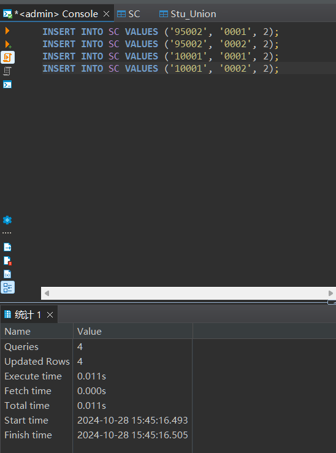
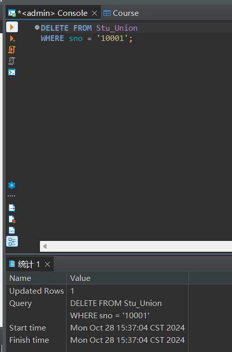
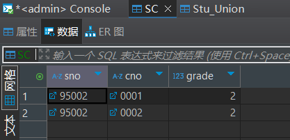

# 实验报告

**姓名：胡瑞康**
**学号：22336087**

## 数据库表结构
- **students (sid, sname, email, grade)**
  学生表，包含学生的编号、姓名、邮箱和年级。
- **teachers (tid, tname, email, salary)**
  教师表，包含教师的编号、姓名、邮箱和薪水。
- **courses (cid, cname, hour)**
  课程表，包含课程的编号、名称和课时。
- **choices (no, sid, tid, cid, score)**
  选课表，包含选课记录的编号、学生编号、教师编号、课程编号和成绩。

## 实验准备（建表操作）

在数据库 school中建立表 Stu_Union,设置sno为主键。建立表Course,令cno为主键。

```sql
CREATE TABLE Stu_Union (
    sno CHAR(5) NOT NULL UNIQUE,
    sname CHAR(8),
    ssex CHAR(1),
    sage INT,
    sdept CHAR(20),
    CONSTRAINT PK_Stu_Union PRIMARY KEY(sno)
);

INSERT INTO Stu_Union VALUES ('10001', '李勇', '0', 24, 'EE');
INSERT INTO Stu_Union VALUES ('95002', '王敏', '1', 23, 'CS');
INSERT INTO Stu_Union VALUES ('95003', '王浩', '0', 25, 'EE');
INSERT INTO Stu_Union VALUES ('95005', '王杰', '0', 25, 'EE');
INSERT INTO Stu_Union VALUES ('95009', '李勇', '0', 25, 'EE');

```

在数据库 school中建立表Course,令cno为主键。
```sql
CREATE TABLE Course (
    cno CHAR(4) NOT NULL UNIQUE,
    cname VARCHAR(50) NOT NULL,
    cpoints INT,
    CONSTRAINT PK PRIMARY KEY(cno)
);
INSERT INTO Course VALUES ('0001', 'ComputerNetworks', 2);
INSERT INTO Course VALUES ('0002', 'Database', 3);

```

建立表SC，令sno和cno分别为参照Stu_Union表以及Course表的外键，设定为级联删除，并令（sno，cno）为其主键。
```sql
CREATE TABLE SC (
    sno CHAR(5) REFERENCES Stu_Union(sno) ON DELETE CASCADE,
    cno CHAR(4) REFERENCES Course(cno) ON DELETE CASCADE,
    grade INT,
    CONSTRAINT PK_SC PRIMARY KEY(sno, cno)
);
```

插入数据
```sql
INSERT INTO SC VALUES ('95002', '0001', 2);
INSERT INTO SC VALUES ('95002', '0002', 2);
INSERT INTO SC VALUES ('10001', '0001', 2);
INSERT INTO SC VALUES ('10001', '0002', 2);
```

建立Stu_Card表，令card_id为主键，并令stu_id 为参照student表的外键，并插入数据。再建立表ICBC_Card表，令card_id为主键，令stu_card_id为参照Stu_Card表的外键
```sql
CREATE TABLE Stu_Card (
    card_id CHAR(14) NOT NULL,
    stu_id CHAR(10) REFERENCES students(sid) ON DELETE CASCADE,
    remained_money DECIMAL,
    CONSTRAINT PK_stu_card PRIMARY KEY(card_id)
);
```

建立表ICBC_Card表
```sql
CREATE TABLE ICBC_Card (
    bank_id CHAR(20),
    stu_card_id CHAR(14) REFERENCES Stu_Card(card_id) ON DELETE CASCADE,
    restored_money DECIMAL(10,2),
    CONSTRAINT PK_Icbc_card PRIMARY KEY(bank_id)
);
```

## 用alter table语句将SC表中的on delete cascade改为on delete no action,重新插入SC的数据（按照实验一） 。再删除Stu_Union中sno为‘10001’的数据。观察结果，并分析原因。
```sql
ALTER TABLE SC
DROP CONSTRAINT FK__SC__sno;

ALTER TABLE SC
ADD CONSTRAINT FK__SC__sno FOREIGN KEY (sno) REFERENCES Stu_Union(sno) ON DELETE NO ACTION;

ALTER TABLE SC
DROP CONSTRAINT FK__SC__cno;

ALTER TABLE SC
ADD CONSTRAINT FK__SC__cno FOREIGN KEY (cno) REFERENCES Course(cno) ON DELETE NO ACTION;
```

重新插入数据
```sql
INSERT INTO SC VALUES ('95002', '0001', 2);
INSERT INTO SC VALUES ('95002', '0002', 2);
INSERT INTO SC VALUES ('10001', '0001', 2);
INSERT INTO SC VALUES ('10001', '0002', 2);
```

删除Stu_Union中sno为‘10001’的数据
```sql
DELETE FROM Stu_Union
WHERE sno = '10001';
```

观察发现SC表中的sno为‘10001’的数据也被删除了。


## 用alter table语句将SC表中的on delete no action改为on delete set NULL,重新插入SC的数据（按照实验一） 。再删除Stu_Union中sno为‘10001’的数据。观察结果，并分析原因。
由于主键限制，需要先去除主键，否则无法set NULL.
```sql
ALTER TABLE SC
DROP CONSTRAINT PK_SC;
```
修改允许NULL
```sql
ALTER TABLE SC
ALTER COLUMN sno CHAR(5) NULL;

ALTER TABLE SC
ALTER COLUMN cno CHAR(4) NULL;
```
修改on delete set NULL
```sql
ALTER TABLE SC
DROP CONSTRAINT FK__SC__sno;

ALTER TABLE SC
ADD CONSTRAINT FK__SC__sno FOREIGN KEY (sno) REFERENCES Stu_Union(sno) ON DELETE SET NULL;

ALTER TABLE SC
DROP CONSTRAINT FK__SC__cno;

ALTER TABLE SC
ADD CONSTRAINT FK__SC__cno FOREIGN KEY (cno) REFERENCES Course(cno) ON DELETE SET NULL;
```


## 建立事务T3，修改ICBC_Card表的外键属性，使其变为on delete set NULL,尝试删除students表中一条记录。观察结果，并分析原因。


## 创建一个班里的学生互助表，规定：包括学生编号，学生姓名，学生的帮助对象，每个学生有且仅有一个帮助对象，帮助对象也必须是班里的学生。（表的自参照问题）

## 学校学生会的每个部门都有一个部长，每个部长领导多个部员，每个部只有一个部员有评测部长的权利，请给出体现这两种关系（领导和评测）的两张互参照的表的定义。（两个表互相参照的问题）

