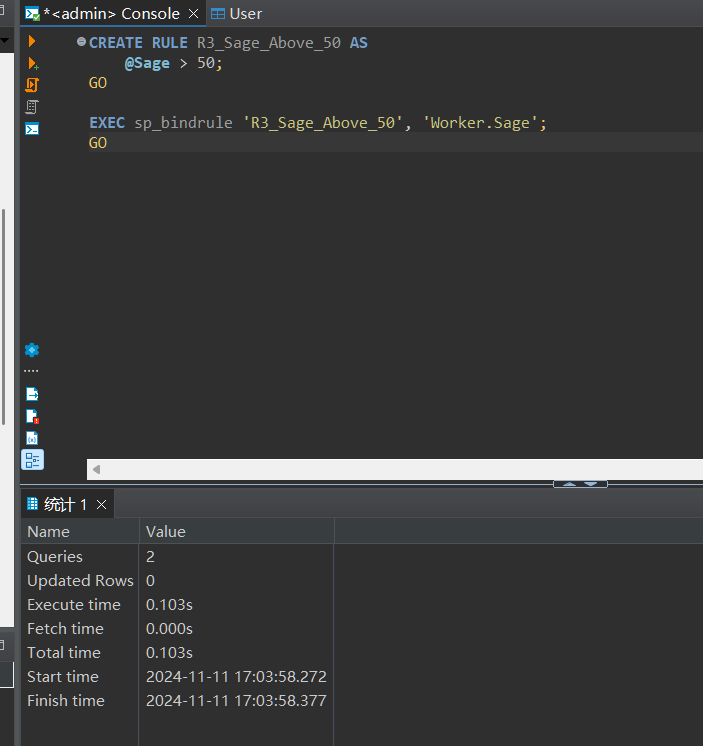

# 实验报告

**姓名：胡瑞康**
**学号：22336087**


## 实验准备（建表操作）

```sql
CREATE TABLE Worker (
    Number CHAR(5),
    Name CHAR(8) CONSTRAINT U1 UNIQUE, -- U1 constraint for unique Name
    Sex CHAR(1),
    Sage INT,
    Department CHAR(20),
    CONSTRAINT PK_Worker PRIMARY KEY (Number)
);
```

## 实验内容

### 1. 加入约束U3，令sage值大于等于0。

```sql
ALTER TABLE Worker
ADD CONSTRAINT U3 CHECK (Sage >= 0);
```

**命令解释**：使用 `ALTER TABLE` 语句向 `Worker` 表添加一个名为 `U3` 的检查约束，确保 `Sage`（年龄）字段的值大于或等于0。

**预期结果**：约束 `U3` 被成功添加到 `Worker` 表，限制 `Sage` 字段的值必须为非负数。


---

### 2. 演示插入违反约束U3的记录。

```sql
INSERT INTO Worker (Number, Name, Sex, Sage, Department)
VALUES ('00006', '张三六', 'M', -5, '销售部');
```

**命令解释**：尝试向 `Worker` 表插入一条记录，其中 `Sage` 的值为 -5，违反了之前添加的 `U3` 约束。

**预期结果**：插入操作失败，SQL Server 返回错误信息，指出违反了检查约束 `U3`。

---

### 3. 演示插入不违反约束U3的记录。

```sql
INSERT INTO Worker (Number, Name, Sex, Sage, Department)
VALUES ('00007', '李四七', 'F', 30, '人事部');
```

**命令解释**：向 `Worker` 表插入一条符合 `U3` 约束的记录，`Sage` 的值为30。

**预期结果**：记录成功插入 `Worker` 表，`Sage` 值为30 满足 `U3` 约束条件。

---

### 4. 加入约束U4，令sage值<0，观察执行是否成功，分析原因。

```sql
ALTER TABLE Worker
ADD CONSTRAINT U4 CHECK (Sage < 0);
```

**命令解释**：尝试向 `Worker` 表添加一个名为 `U4` 的检查约束，要求 `Sage` 的值小于0。

**预期结果**：执行失败，SQL Server 返回错误，因为现有记录（如 `Sage` 为30）不满足新的 `U4` 约束，导致约束无法被添加。

**原因分析**：由于表中已有记录的 `Sage` 值不小于0，添加 `U4` 约束会与现有数据冲突，因此 SQL Server 不允许添加此约束。

---

### 5. 加入规则R2，确保插入的记录的sage值在1到100之间，并绑定到sage属性。

```sql
CREATE RULE R2_Sage_Range AS
    @Sage BETWEEN 1 AND 100;
GO

-- 将规则绑定到 Worker 表的 Sage 列
EXEC sp_bindrule 'R2_Sage_Range', 'Worker.Sage';
GO
```

**命令解释**：
1. 使用 `CREATE RULE` 创建一个名为 `R2_Sage_Range` 的规则，确保 `Sage` 的值在1到100之间。
2. 使用 `sp_bindrule` 存储过程将规则 `R2_Sage_Range` 绑定到 `Sage` 属性上。

**预期结果**：规则 `R2_Sage_Range` 被成功创建并绑定到 `Sage` 字段，限制新插入或更新的 `Sage` 值必须介于1到100之间。

---

### 6. 演示插入违反R2的记录。

```sql
INSERT INTO Worker (Number, Name, Sex, Sage, Department)
VALUES ('00008', '王五八', 'M', 150, '技术部');
```

**命令解释**：尝试向 `Worker` 表插入一条记录，其中 `Sage` 的值为150，超出了规则 `R2_Sage_Range` 的限制（1到100）。

**预期结果**：插入操作失败，SQL Server 返回错误信息，指出违反了绑定到 `Sage` 字段的规则 `R2_Sage_Range`。

---

### 7. 解除规则R2的绑定，并重复(6)的操作。

```sql
EXEC sp_unbindrule 'Worker.Sage';
GO

-- 再次尝试插入违反R2的记录
INSERT INTO Worker (Number, Name, Sex, Sage, Department)
VALUES ('00008', '王五八', 'M', 150, '技术部');
```

**命令解释**：
1. 使用 `sp_unbindrule` 存储过程解除 `Sage` 字段与规则 `R2_Sage_Range` 的绑定。
2. 再次尝试插入 `Sage` 值为150的记录。

**预期结果**：
1. 规则 `R2_Sage_Range` 被成功解除绑定。
2. 插入操作成功，`Sage` 值为150 的记录被成功插入 `Worker` 表，因为不再有规则限制。

---

### 8. 已知示例三中已插入sage为38的记录，那么加入规则R3，令sage大于50。观察加入规则R3的操作是否能成功。

```sql
CREATE RULE R3_Sage_Above_50 AS
    @Sage > 50;
GO

ALTER TABLE Worker
ADD CONSTRAINT R3 CHECK (Sage > 50);
```

**命令解释**：
1. 使用 `CREATE RULE` 创建一个名为 `R3_Sage_Above_50` 的规则，要求 `Sage` 的值大于50。
2. 使用 `ALTER TABLE` 向 `Worker` 表添加一个检查约束 `R3`，确保 `Sage` 大于50。

**预期结果**：执行失败，SQL Server 返回错误，因为表中已存在 `Sage` 值为38的记录，不满足新添加的 `R3` 约束条件。

**原因分析**：由于现有记录中有 `Sage` 值小于或等于50，添加 `R3` 约束会与这些数据冲突，因此 SQL Server 不允许添加此约束。

