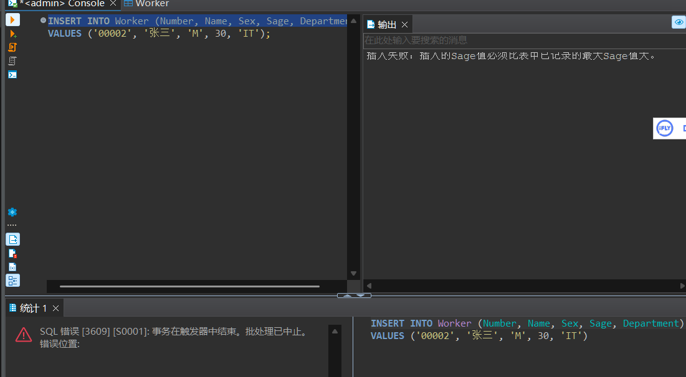

# 实验报告

**姓名：胡瑞康**
**学号：22336087**


## 数据表信息

### 原版数据表
- **students (sid, sname, email, grade)**
  学生表，包含学生的编号、姓名、邮箱和年级。
- **teachers (tid, tname, email, salary)**
  教师表，包含教师的编号、姓名、邮箱和薪水。
- **courses (cid, cname, hour)**
  课程表，包含课程的编号、名称和课时。
- **choices (no, sid, tid, cid, score)**
  选课表，包含选课记录的编号、学生编号、教师编号、课程编号和成绩。

### 新增数据表

```sql
CREATE TABLE Worker (
    Number CHAR(5),
    Name CHAR(8) CONSTRAINT U1 UNIQUE,
    Sex CHAR(1),
    Sage INT,
    Department CHAR(20),
    CONSTRAINT PK_Worker PRIMARY KEY (Number)
);
```

```sql
CREATE TABLE Stu_Card (
    card_id CHAR(14) NOT NULL,
    stu_id CHAR(10) REFERENCES students(sid) ON DELETE CASCADE,
    remained_money DECIMAL,
    CONSTRAINT PK_stu_card PRIMARY KEY(card_id)
);
```
## 实验内容

### 1. 建立触发器T4

要求：插入记录时，`Sage` 值必须比表中已记录的最大 `Sage` 值大。

```sql
CREATE TRIGGER T4
ON Worker
INSTEAD OF INSERT
AS
BEGIN
    DECLARE @MaxSage INT
    SELECT @MaxSage = MAX(Sage) FROM Worker

    IF EXISTS (
        SELECT 1
        FROM inserted
        WHERE Sage <= @MaxSage
    )
    BEGIN
        PRINT '插入失败：插入的Sage值必须比表中已记录的最大Sage值大。'
        ROLLBACK TRANSACTION
    END
    ELSE
    BEGIN
        INSERT INTO Worker (Number, Name, Sex, Sage, Department)
        SELECT Number, Name, Sex, Sage, Department
        FROM inserted
    END
END
```
**功能**：确保在向 `Worker` 表插入数据时，新记录中的 `Sage` 值必须大于表中已存在的最大 `Sage` 值。
- 使用 `INSTEAD OF INSERT` 触发器。
- 若插入的数据不满足条件，则触发器阻止插入并回滚事务。


### 2. 演示违反触发器T4的操作


```sql
INSERT INTO Worker (Number, Name, Sex, Sage, Department)
VALUES ('00002', '张三', 'M', 30, 'IT');
```

触发器会阻止该插入，并输出 `插入失败：插入的Sage值必须比表中已记录的最大Sage值大。`



### 3. 建立触发器T5

要求：更新记录时，新 `Sage` 值必须比旧 `Sage` 值大。

```sql
CREATE TRIGGER T5
ON Worker
INSTEAD OF UPDATE
AS
BEGIN
    IF EXISTS (
        SELECT 1
        FROM inserted i
        JOIN deleted d
        ON i.Number = d.Number
        WHERE i.Sage <= d.Sage
    )
    BEGIN
        PRINT '更新失败：更新后的Sage值必须比原来的大。'
        ROLLBACK TRANSACTION
    END
    ELSE
    BEGIN
        UPDATE Worker
        SET Number = i.Number,
            Name = i.Name,
            Sex = i.Sex,
            Sage = i.Sage,
            Department = i.Department
        FROM inserted i
        WHERE Worker.Number = i.Number
    END
END
```
**功能**：在更新 `Worker` 表的记录时，新 `Sage` 值必须大于旧 `Sage` 值。
- 使用 `INSTEAD OF UPDATE` 触发器。
- 若更新后的数据不满足条件，则触发器阻止更新并回滚事务。


### 4. 演示违反触发器T5的操作

```sql
UPDATE Worker
SET Sage = 25
WHERE Number = '00007';
--旧的是30
```


触发器会阻止该更新，并输出 `更新失败：更新后的Sage值必须比原来的大。`

### 5. 为 `Worker` 表建立触发器T6

要求：禁止修改编号为 `00001` 的记录。

```sql
CREATE TRIGGER T6
ON Worker
INSTEAD OF UPDATE
AS
BEGIN
    IF EXISTS (
        SELECT 1
        FROM inserted
        WHERE Number = '00001'
    )
    BEGIN
        PRINT '更新失败：禁止修改编号为00001的记录。'
        ROLLBACK TRANSACTION
    END
    ELSE
    BEGIN
        UPDATE Worker
        SET Number = i.Number,
            Name = i.Name,
            Sex = i.Sex,
            Sage = i.Sage,
            Department = i.Department
        FROM inserted i
        WHERE Worker.Number = i.Number
    END
END
```
**功能**：禁止修改编号为 `00001` 的记录。
- 使用 `INSTEAD OF UPDATE` 触发器。
- 若更新的记录编号为 `00001`，触发器阻止更新并回滚事务。

直接执行提示：SQL 错误 [2111] [S0001]: 无法对 表 'Worker' 创建 触发器 'T6'，因为此对象已有 INSTEAD OF UPDATE 触发器。

删除T4，T5后重新执行


验证结果

```sql
UPDATE Worker SET Name=N'bbb' WHERE Number=N'00001';
```
触发器阻止了修改


### 6. 基于 `students` 和 `stu_card` 表的视图和触发器

> 建立基于students和stu_card两个表的视图，创建INSTEADOF触发器使该视图支持更新操作，并演示更新操作。 （注：stu_card的建表见PPT10参照完整性page10）


视图 `Student_Card_View` 包含学生的基本信息和卡片信息。
使用 `LEFT JOIN` 连接 `students` 表和 `Stu_Card` 表。

```sql
CREATE VIEW Student_Card_View AS
SELECT
    s.sid AS StudentID,
    s.sname AS StudentName,
    s.email AS Email,
    s.grade AS Grade,
    sc.card_id AS CardID,
    sc.remained_money AS RemainedMoney
FROM
    students s
LEFT JOIN
    Stu_Card sc ON s.sid = sc.stu_id;
```


为了使视图 `Student_Card_View` 支持更新操作，需要创建一个 `INSTEAD OF UPDATE` 触发器 `Trig_Student_Card_Update`。该触发器将根据更新的字段，分别更新 `students` 表和 `Stu_Card` 表。

```sql
CREATE TRIGGER Trig_Student_Card_Update
ON Student_Card_View
INSTEAD OF UPDATE
AS
BEGIN
    -- 更新 students 表
    UPDATE students
    SET
        sname = i.StudentName,
        email = i.Email,
        grade = i.Grade
    FROM inserted i
    WHERE students.sid = i.StudentID;

    -- 更新 Stu_Card 表
    UPDATE Stu_Card
    SET
        card_id = i.CardID,
        remained_money = i.RemainedMoney
    FROM inserted i
    WHERE Stu_Card.stu_id = i.StudentID;
END;
```


假设我们要更新学生编号为 `800001216` 的记录，将其`StudentName`改为 `aaa`，`CardID`为`05212568`。

```sql
UPDATE Student_Card_View
SET
    StudentName = 'aaa',
    CardID = '05212568'
WHERE StudentID = '800001216';
```


查询 `students` 表和 `Stu_Card` 表，确认更新操作是否成功。

```sql
SELECT * FROM students WHERE sid = '800001216';
SELECT * FROM Stu_Card WHERE stu_id = '800001216';
```
结果：成功修改了另外两个表的内容

