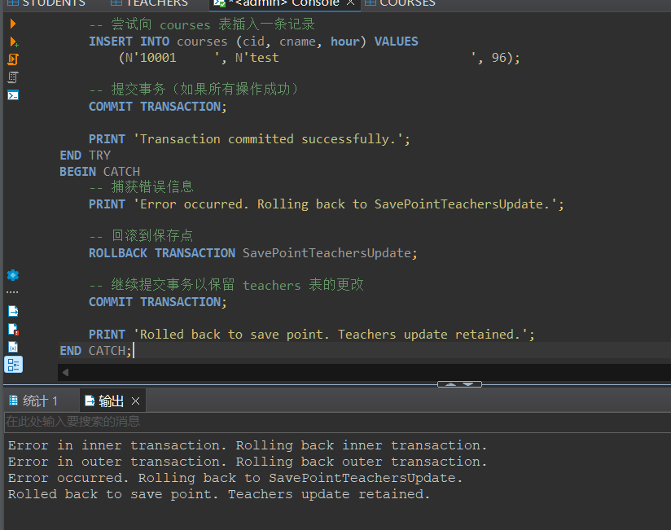
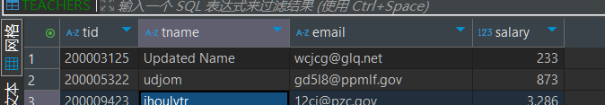

# 实验报告

**姓名：胡瑞康**
**学号：22336087**


# 数据表信息
- **students (sid, sname, email, grade)**
  学生表，包含学生的编号、姓名、邮箱和年级。
- **teachers (tid, tname, email, salary)**
  教师表，包含教师的编号、姓名、邮箱和薪水。
- **courses (cid, cname, hour)**
  课程表，包含课程的编号、名称和课时。
- **choices (no, sid, tid, cid, score)**
  选课表，包含选课记录的编号、学生编号、教师编号、课程编号和成绩。


# 编写一个嵌套事务。外层修改students表某记录，内层在teachers表插入一条记录。演示内层插入操作失败后，外层修改操作回滚。

```sql
-- 开启事务
BEGIN TRANSACTION OuterTransaction;

BEGIN TRY
    -- 外层事务：修改 students 表的一条记录
    UPDATE students
    SET sname = 'bbb'
    WHERE sid = 800001216;

    -- 开启内层事务
    BEGIN TRANSACTION InnerTransaction;

    BEGIN TRY
        -- 内层事务：向 teachers 表插入一条记录
        INSERT INTO School.dbo.TEACHERS (tid,tname,email,salary) VALUES
	      (N'200003125 ',N'fqmmyi',N'wcjcg@glq.net',233);


        -- 提交内层事务
        COMMIT TRANSACTION InnerTransaction;
    END TRY
    BEGIN CATCH
        -- 捕获内层事务中的错误
        PRINT 'Error in inner transaction. Rolling back inner transaction.';

        -- 回滚内层事务
        ROLLBACK TRANSACTION InnerTransaction;

        -- 引发错误以通知外层事务
        THROW;
    END CATCH;

    -- 如果内层事务成功，则继续提交外层事务
    COMMIT TRANSACTION OuterTransaction;
END TRY
BEGIN CATCH
    -- 捕获外层事务中的错误
    PRINT 'Error in outer transaction. Rolling back outer transaction.';

    -- 回滚外层事务
    ROLLBACK TRANSACTION OuterTransaction;
END CATCH;
```

由于内层失败，外层回滚，所以学生记录也没更新

# 编写一个带有保存点的事务。更新teachers表中数据后，设置事务保存点，然后在表courses中插入数据，如果courses插入数据失败，则回滚到事务保存点。演示# courses插入失败，但teachers表更新成功的操作。
```sql
-- 开启事务
BEGIN TRANSACTION;

BEGIN TRY
    -- 更新 teachers 表中 tid = 200003125 的记录
    UPDATE teachers
    SET tname = 'Updated Name'
    WHERE tid = 200003125;

    -- 设置事务保存点
    SAVE TRANSACTION SavePointTeachersUpdate;

    -- 尝试向 courses 表插入一条记录
    INSERT INTO courses (cid, cname, hour) VALUES
        (N'10001     ', N'test                          ', 96);

    -- 提交事务（如果所有操作成功）
    COMMIT TRANSACTION;

    PRINT 'Transaction committed successfully.';
END TRY
BEGIN CATCH
    -- 捕获错误信息
    PRINT 'Error occurred. Rolling back to SavePointTeachersUpdate.';

    -- 回滚到保存点
    ROLLBACK TRANSACTION SavePointTeachersUpdate;

    -- 继续提交事务以保留 teachers 表的更改
    COMMIT TRANSACTION;

    PRINT 'Rolled back to save point. Teachers update retained.';
END CATCH;
```

最终插入失败，但是老师名字更新成功


# 编写一个包含事务的存储过程，用于更新courses表的课时。如果更新记录的cid不存在，则输出“课程信息不存在”，其他错误输出“修改课时失败”，如果执行成功，则输出“课时修改成功”。调用该存储过程，演示更新成功与更新失败的操作
```sql
CREATE PROCEDURE UpdateCourseHours
    @cid NVARCHAR(50),  -- 课程编号
    @newHour INT         -- 新课时
AS
BEGIN
    -- 开启事务
    BEGIN TRANSACTION;

    BEGIN TRY
        -- 检查课程是否存在
        IF NOT EXISTS (SELECT 1 FROM courses WHERE cid = @cid)
        BEGIN
            -- 如果课程不存在，回滚事务并输出消息
            ROLLBACK TRANSACTION;
            PRINT '课程信息不存在';
            RETURN;
        END

        -- 如果课程存在，执行更新操作
        UPDATE courses
        SET hour = @newHour
        WHERE cid = @cid;

        -- 提交事务
        COMMIT TRANSACTION;
        PRINT '课时修改成功';
    END TRY
    BEGIN CATCH
        -- 捕获其他错误，回滚事务并输出错误消息
        ROLLBACK TRANSACTION;
        PRINT '修改课时失败';
    END CATCH;
END;
```


情况 1：课程 `cid = 10001` 存在，课时更新成功

调用存储过程，更新课程编号为 `10001` 的课时。

```sql
EXEC UpdateCourseHours @cid = N'10001', @newHour = 120;
```

**运行结果**：


情况 2：课程 `cid = 10000` 不存在，更新失败

调用存储过程，尝试更新课程编号为 `10000` 的课时。

```sql
EXEC UpdateCourseHours @cid = N'10000', @newHour = 120;
```

**运行结果**：

