# 实验报告

**姓名：胡瑞康**
**学号：22336087**


# 数据表信息
- **students (sid, sname, email, grade)**
  学生表，包含学生的编号、姓名、邮箱和年级。
- **teachers (tid, tname, email, salary)**
  教师表，包含教师的编号、姓名、邮箱和薪水。
- **courses (cid, cname, hour)**
  课程表，包含课程的编号、名称和课时。
- **choices (no, sid, tid, cid, score)**
  选课表，包含选课记录的编号、学生编号、教师编号、课程编号和成绩。


# 设置“未提交读”隔离级别（READ UNCOMMITTED），在students表上演示读“脏”数据。

要在 SQL Server 中模拟和测试 **未提交读**（`READ UNCOMMITTED`）隔离级别的“脏读”现象，需要使用两个独立的会话。以下是如何在两个会话中拆分的操作来演示“脏读”现象。

会话 1（会话 1：未提交读）
```sql
-- 会话 1：未提交读
SET TRANSACTION ISOLATION LEVEL READ UNCOMMITTED;
BEGIN TRANSACTION;

-- 从 students 表读取数据
SELECT * FROM students;

-- 不提交事务，模拟数据修改
UPDATE students
SET sname = 'DirtyReadTest'
WHERE sid = 800001216;

-- 等待会话 2 执行查询
-- 此时数据未提交
WAITFOR DELAY '00:00:20'; -- 等待 20 秒钟，以便会话 2 有时间执行查询

-- 回滚事务
ROLLBACK TRANSACTION;
```
说明：
- 会话 1 设置了 `READ UNCOMMITTED` 隔离级别，开始一个事务。
- 会话 1 查询 `students` 表的数据，进行修改，但是没有提交事务。
- 在 `UPDATE` 语句后，`WAITFOR DELAY` 命令确保有足够的时间进行会话 2 中的查询，以模拟脏读现象。
- 最后，回滚事务。

会话 2（会话 2：读取脏数据）
在会话 2 中，将读取 `students` 表的数据，查看是否能读取到会话 1 中尚未提交的修改。

```sql
-- 会话 2：读取脏数据
SET TRANSACTION ISOLATION LEVEL READ UNCOMMITTED;

-- 从 students 表读取 sid = 800001216 的记录
SELECT * FROM students WHERE sid = 800001216;
```
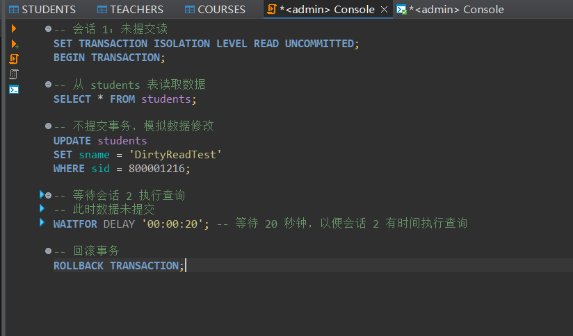
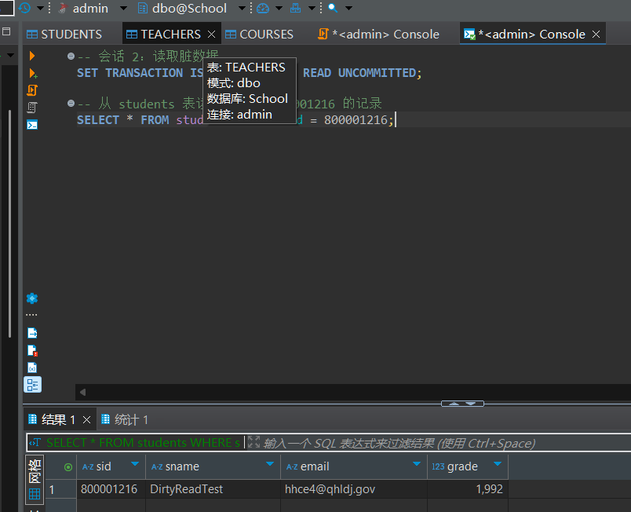
说明：
- 会话 2 中设置 `READ UNCOMMITTED` 隔离级别，使得它能够读取其他未提交事务的数据。
- 当在会话 1 中修改了 `sname` 值并没有提交时，会话 2 能够看到未提交的脏数据。

# 设置“提交读”隔离级别（READ COMMITTED），在students表上演示避免读“脏”数据。

会话 1：未提交事务
```sql
SET TRANSACTION ISOLATION LEVEL READ COMMITTED;
BEGIN TRANSACTION;

UPDATE students
SET sname = 'DirtyReadAvoided'
WHERE sid = 800001216;

-- 不提交事务，停留在修改状态
WAITFOR DELAY '00:00:20'; -- 等待 20 秒钟，以便会话 2 有时间执行查询

-- 回滚事务
ROLLBACK TRANSACTION;
```

会话 2：测试隔离级别
```sql
SET TRANSACTION ISOLATION LEVEL READ COMMITTED;

-- 尝试读取 sid = 800001216 的记录
SELECT * FROM students WHERE sid = 800001216;
```
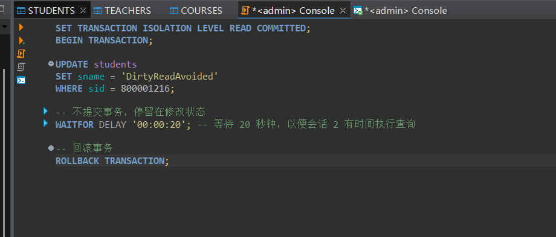
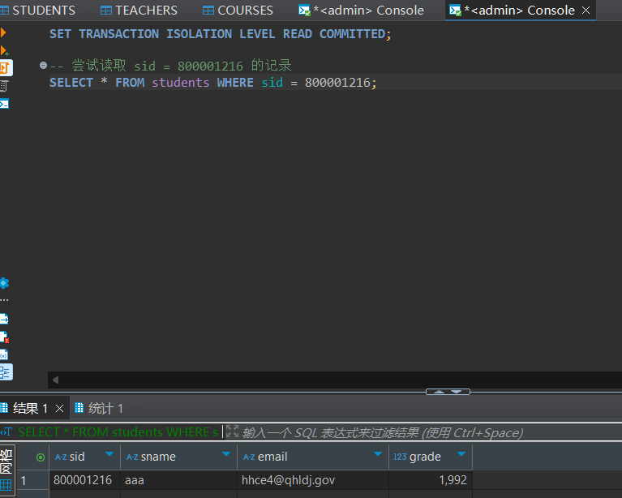
说明：
1. **提交读**：在这种隔离级别下，事务只能读取到其他事务已提交的数据。
2. **现象**：事务未提交时，另一个事务无法读取到修改的数据。


为了演示 SQL Server 中的不同事务隔离级别，我们将继续使用 `students` 表和 `sid = 800001216` 作为示例数据，进一步展示 **可重复读（REPEATABLE READ）** 和 **可串行化（SERIALIZABLE）** 隔离级别的行为。

# 设置“可重复读”隔离级别（REPEATABLE READ），防止读“脏”数据和不可重复读，但不能避免幻象读。

## 避免脏读和不可重复读

会话 1（会话 1：可重复读）

```sql
-- 会话 1：可重复读
SET TRANSACTION ISOLATION LEVEL REPEATABLE READ;
BEGIN TRANSACTION;

-- 从 students 表读取数据
SELECT * FROM students WHERE sid = 800001216;

-- 不提交事务，模拟数据修改
UPDATE students
SET sname = 'RepeatableReadTest'
WHERE sid = 800001216;

-- 等待会话 2 执行查询
WAITFOR DELAY '00:00:20'; -- 等待 20 秒钟，以便会话 2 有时间执行查询

-- 回滚事务
ROLLBACK TRANSACTION;
```

说明：
- 会话 1 设置了 `REPEATABLE READ` 隔离级别，开始一个事务。
- 会话 1 查询 `students` 表的数据并修改了数据，但未提交。
- 在 `UPDATE` 后，`WAITFOR DELAY` 使会话 2 可以查询数据，演示会话 1 中的数据修改。
- 最后，回滚事务。

会话 2（会话 2：不可重复读）

```sql
-- 会话 2：读取数据
SET TRANSACTION ISOLATION LEVEL REPEATABLE READ;

-- 从 students 表读取 sid = 800001216 的记录
SELECT * FROM students WHERE sid = 800001216;
```
说明：
- 会话 2 设置了 `REPEATABLE READ` 隔离级别，确保在事务执行过程中数据不会被修改或删除。
- 由于 `REPEATABLE READ` 锁定了行，因此会话 2 不会看到会话 1 中尚未提交的数据修改。

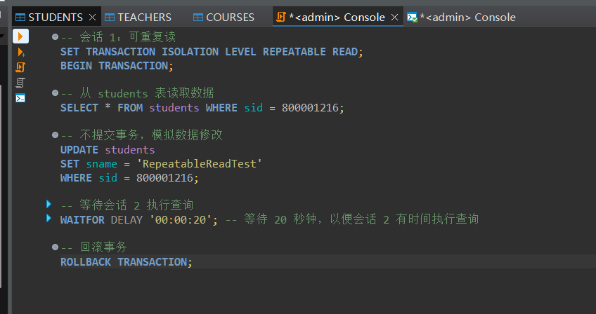
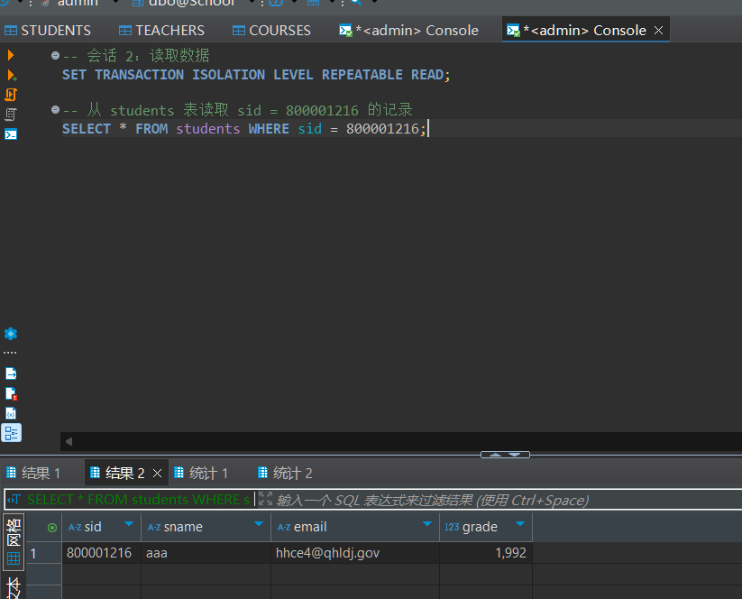

## 不能避免幻象读

会话 1（会话 1：可重复读，读取数据）
```sql
-- 会话 1：可重复读
SET TRANSACTION ISOLATION LEVEL REPEATABLE READ;
BEGIN TRANSACTION;

SELECT * FROM students where sid = 800001300;

-- 不提交事务，停留在修改状态
WAITFOR DELAY '00:00:20'; -- 等待 20 秒钟，以便会话 2 有时间插入数据

SELECT * FROM students where sid = 800001300;

-- 继续等待直到回滚
ROLLBACK TRANSACTION;
```

会话 2（会话 2：插入新数据，触发幻象读）
```sql
-- 会话 2：插入新数据
SET TRANSACTION ISOLATION LEVEL READ COMMITTED;

-- 向 students 表中插入新记录
INSERT INTO students (sid, sname)
VALUES (800001300, 'PhantomReadTest');

-- 提交事务
COMMIT TRANSACTION;
```

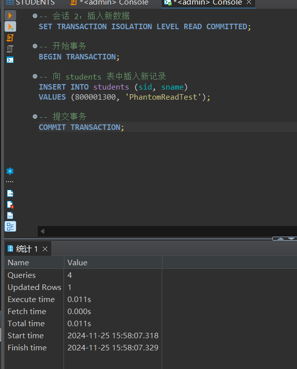
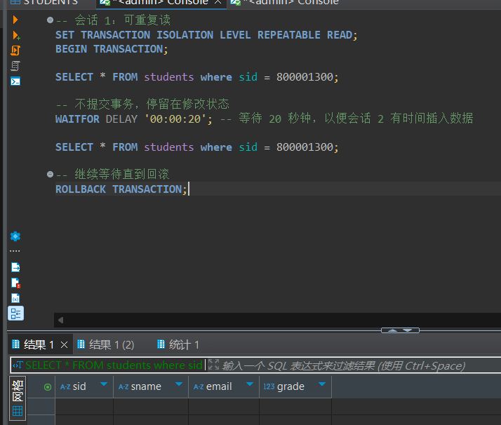
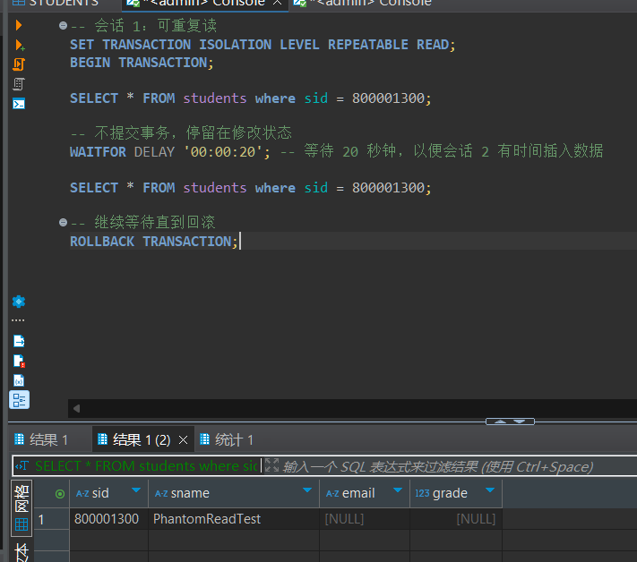
说明：
- 最开始，会话 1 读取了 sid = 800001300 的记录，读取不到
- 会话 2 插入了一条新记录，sid = 800001300，会话 1 再次读取，发现了这条新记录，这就是幻象读。
# 设置 “可串行化”隔离级别(SERIALIZABLE)，在students表上演示防止其他用户在事务提交之前更新数据。

会话 1：开启事务并设置隔离级别为 `SERIALIZABLE`

```sql
-- 会话 1：设置隔离级别为 SERIALIZABLE 并锁定查询范围
SET TRANSACTION ISOLATION LEVEL SERIALIZABLE;
BEGIN TRANSACTION;

-- 查询 sid = 800001216 的记录
SELECT * FROM students WHERE sid = 800001216;

-- 停留在事务中，模拟事务长时间运行
WAITFOR DELAY '00:00:20'; -- 等待 20 秒钟，以便会话 2 尝试修改数据

SELECT * FROM students WHERE sid = 800001216;

-- 回滚事务，释放锁
ROLLBACK TRANSACTION;
```

说明：
- 会话 1 设置了 `SERIALIZABLE` 隔离级别。
- 查询了 `students` 表中 `sid = 800001216` 的记录，并锁定了该行。
- 停留 20 秒，确保会话 2 有机会执行修改操作。

会话 2：尝试更新 `students` 表中的记录

```sql
-- 会话 2：尝试更新 sid = 800001216 的记录
SET TRANSACTION ISOLATION LEVEL READ COMMITTED;

BEGIN TRANSACTION;

-- 尝试更新 sid = 800001216 的记录
UPDATE students
SET sname = 'UpdateAttempt'
WHERE sid = 800001216;

-- 提交事务
COMMIT TRANSACTION;
```

**预期结果**：
- 由于会话 1 已锁定 `sid = 800001216` 的记录，会话 2 尝试更新时会被阻塞，直到会话 1 回滚或提交事务。
- 只有当会话 1 完成后，会话 2 的更新操作才会继续。


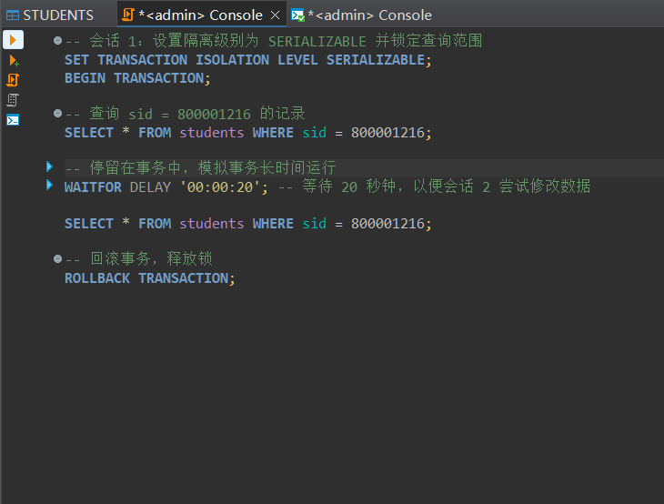
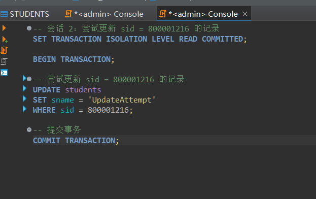
会话2被阻塞没办法更新

等结束了会话1，会话2方才正常运行
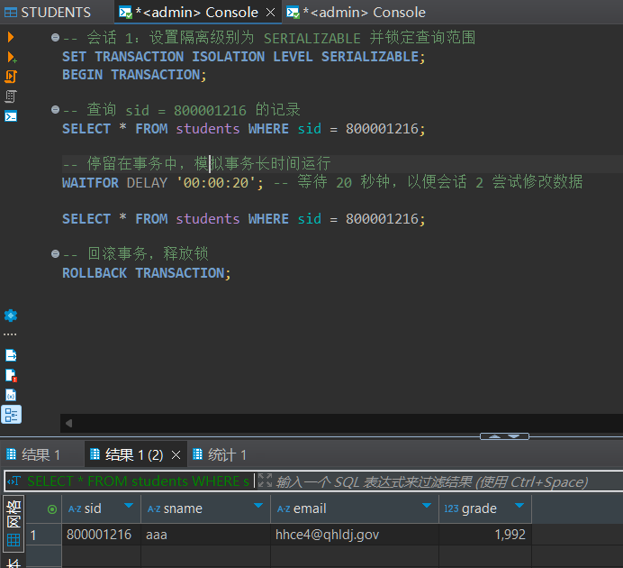
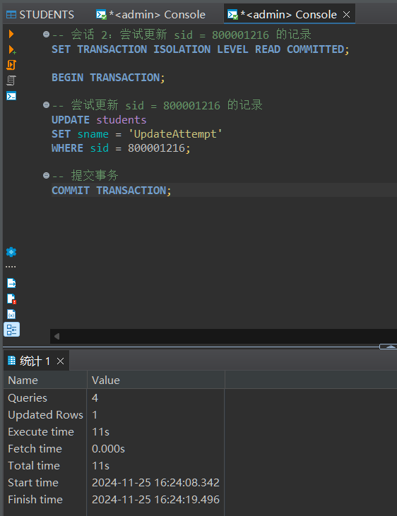