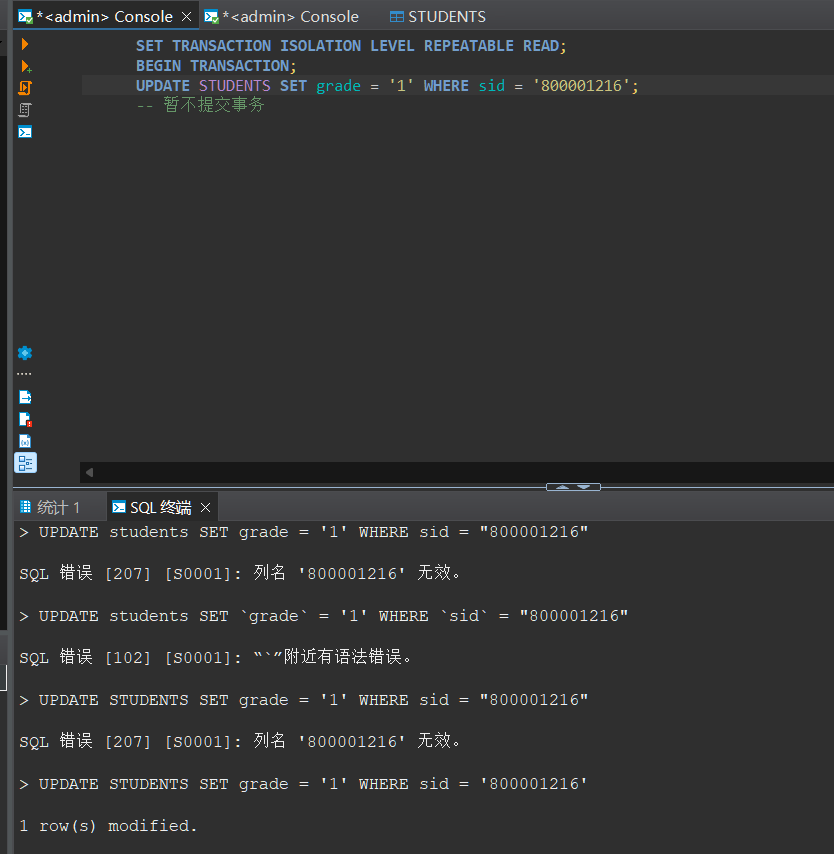
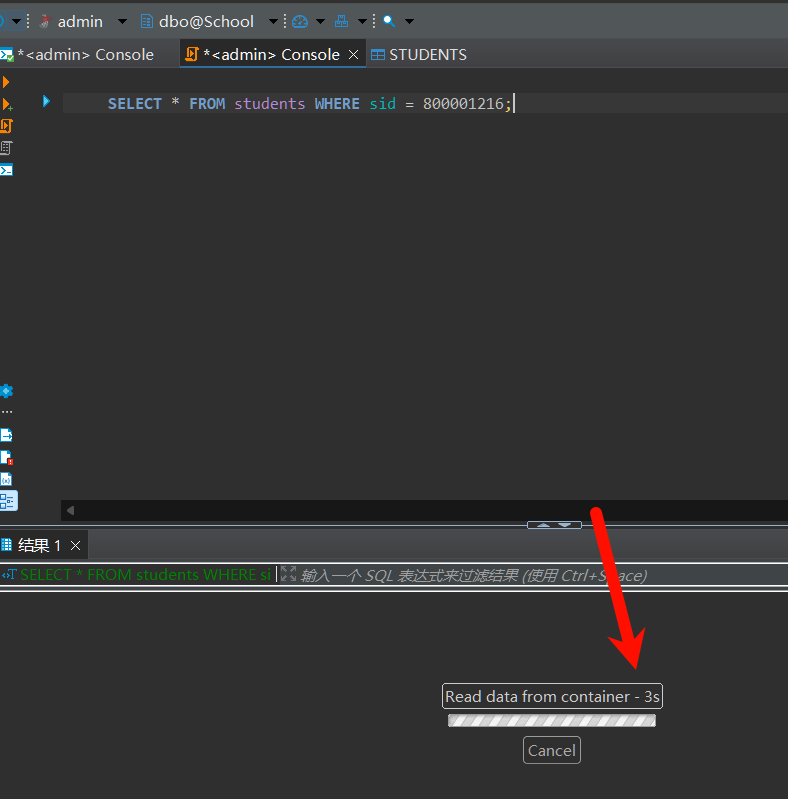
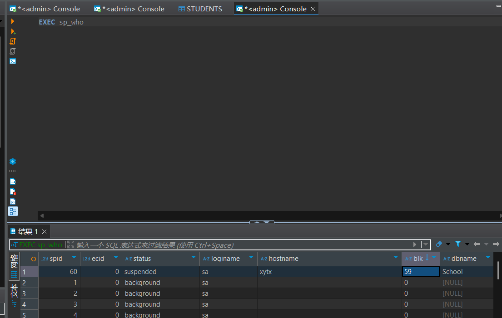
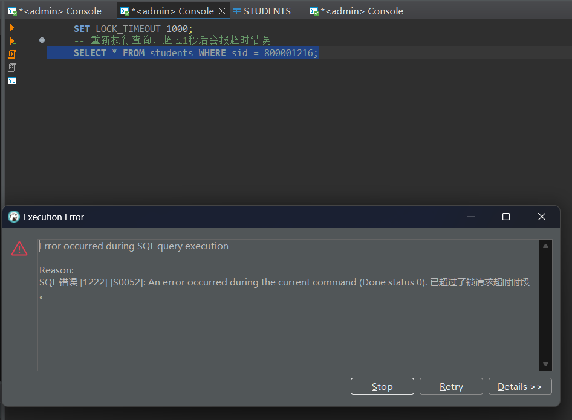
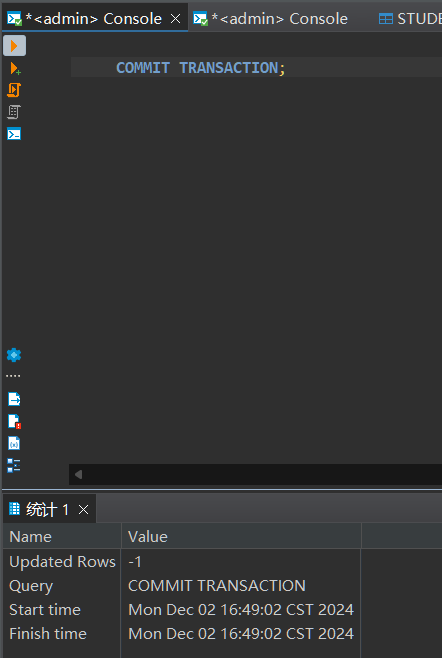
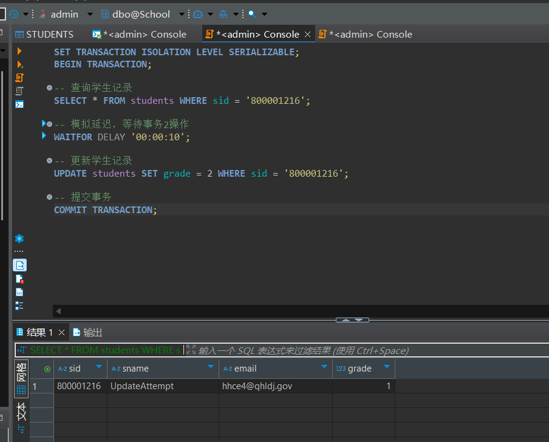
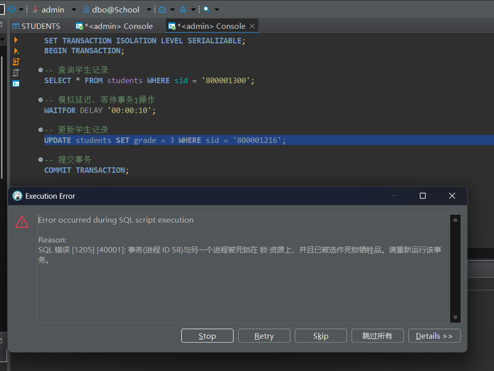
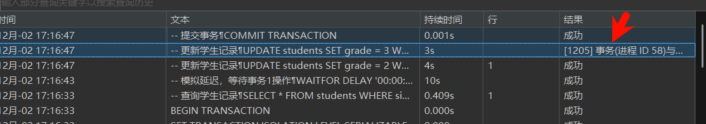

## 实验报告

**姓名：胡瑞康**
**学号：22336087**

---

## 1. 在 students 表上演示锁争夺，通过 sp_who 查看阻塞的进程。通过设置 lock_timeout 解除锁争夺。


1. **连接1：**
   - 设置事务隔离级别为可重复读，启动事务并更新一条记录但不提交：
     ```sql
      SET TRANSACTION ISOLATION LEVEL REPEATABLE READ;
      BEGIN TRANSACTION;
      UPDATE students SET grade = '1' WHERE sid = '800001216';
      -- 暂不提交事务
     ```

2. **连接2：**
   - 尝试查询同一记录：
     ```sql
     SELECT * FROM students WHERE sid = 800001216;
     -- 该查询将被阻塞，等待连接1释放锁
     ```

3. **查看阻塞进程：**
   - 在新的连接中执行：
     ```sql
     EXEC sp_who;
     -- 查看blk列，非0值表示被阻塞
     ```

4. **设置 lock_timeout 并解除锁争夺：**
   - 在连接2中设置 lock_timeout 为 1000 毫秒（1秒）：
     ```sql
     SET LOCK_TIMEOUT 1000;
     -- 重新执行查询，超过1秒后会报超时错误
     SELECT * FROM students WHERE sid = 800001216;
     ```

5. **连接1提交事务：**
   - 提交事务以释放锁：
     ```sql
     COMMIT TRANSACTION;
     ```

6. **连接2查询成功：**
   - 连接2再次查询成功执行，返回结果。

### 实验现象：
- 连接2的查询在连接1未提交事务时被阻塞。
- 通过 `sp_who` 可以看到连接2被连接1阻塞。
- 设置 `lock_timeout` 后，连接2的查询在超时后返回错误，而不是无限期等待。

---

## 2. 在 students 表上演示死锁。

1. **开启事务1：**

```sql
SET TRANSACTION ISOLATION LEVEL SERIALIZABLE;
BEGIN TRANSACTION;

-- 查询学生记录
SELECT * FROM students WHERE sid = '800001216';

-- 模拟延迟，等待事务2操作
WAITFOR DELAY '00:00:10';

-- 更新学生记录
UPDATE students SET grade = 2 WHERE sid = '800001300';

-- 提交事务
COMMIT TRANSACTION;
```

2. **开启事务2（在另一个会话中执行）：**

```sql
SET TRANSACTION ISOLATION LEVEL SERIALIZABLE;
BEGIN TRANSACTION;

-- 查询学生记录
SELECT * FROM students WHERE sid = '800001300';

-- 模拟延迟，等待事务1操作
WAITFOR DELAY '00:00:10';

-- 更新学生记录
UPDATE students SET grade = 3 WHERE sid = '800001216';

-- 提交事务
COMMIT TRANSACTION;
```
事务1持有 sid = 800001216 的锁，等待 sid = 800001300 的锁。

事务2持有 sid = 800001300 的锁，等待 sid = 800001216 的锁。

这种循环等待导致死锁。



---

## 3. 讨论如何避免死锁以及死锁的处理方法。
### 避免死锁的方法：

1. **锁定顺序一致**：
   - 确保所有事务按照相同的顺序访问和锁定资源。例如，如果一个事务总是先锁定 `sid = 800001216` 然后锁定 `sid = 800001300`，另一个事务也遵循相同的顺序，那么就可以避免死锁。

2. **最小化锁定时间**：
   - 尽量减少事务持有锁的时间。通过快速完成事务、减少不必要的查询和操作，可以降低死锁发生的概率。

3. **使用较低的隔离级别**：
   - 在可能的情况下，使用较低的事务隔离级别（如读提交）而不是可序列化隔离级别，可以减少锁的冲突。

4. **超时机制**：
   - 设置适当的锁超时时间，避免事务无限期地等待锁。如果事务在等待锁时超时，可以捕获错误并重新尝试。

5. **减少事务大小**：
   - 尽量将事务保持在较小的范围内，减少持有锁的时间和资源范围。

### 死锁的处理方法：

1. **死锁检测与解决**：
   - 数据库管理系统（如 SQL Server）通常会自动检测死锁，并选择一个牺牲品（通常是成本较低的事务）进行回滚，释放锁，使其他事务可以继续执行。

2. **错误处理与重试**：
   - 在应用程序中捕获死锁错误（如 SQL Server 的错误代码 1205），并实施重试逻辑。通常，死锁是暂时性的，重试操作可以成功执行。

3. **日志记录与分析**：
   - 记录死锁事件的日志，分析死锁产生的原因，并优化数据库设计和事务逻辑，以减少死锁的发生。

4. **资源重新组织**：
   - 重新组织数据库资源的访问顺序，确保事务以一致的顺序访问资源，避免循环等待。
