## 实验报告

**姓名：胡瑞康**
**学号：22336087**

---

# 数据表信息

- **students (sid, sname, email, grade)**
  学生表，包含学生的编号、姓名、邮箱和年级。
- **teachers (tid, tname, email, salary)**
  教师表，包含教师的编号、姓名、邮箱和薪水。
- **courses (cid, cname, hour)**
  课程表，包含课程的编号、名称和课时。
- **choices (no, sid, tid, cid, score)**
  选课表，包含选课记录的编号、学生编号、教师编号、课程编号和成绩。

---
# 1.在school数据库上创建用户“王二”，在students表上创建视图grade2000，将年级为2000的学生元组放入视图。
```sql
exec sp_addlogin '王二', '123456', 'School', 'English'
go
use School
go
exec sp_grantdbaccess '王二'
```
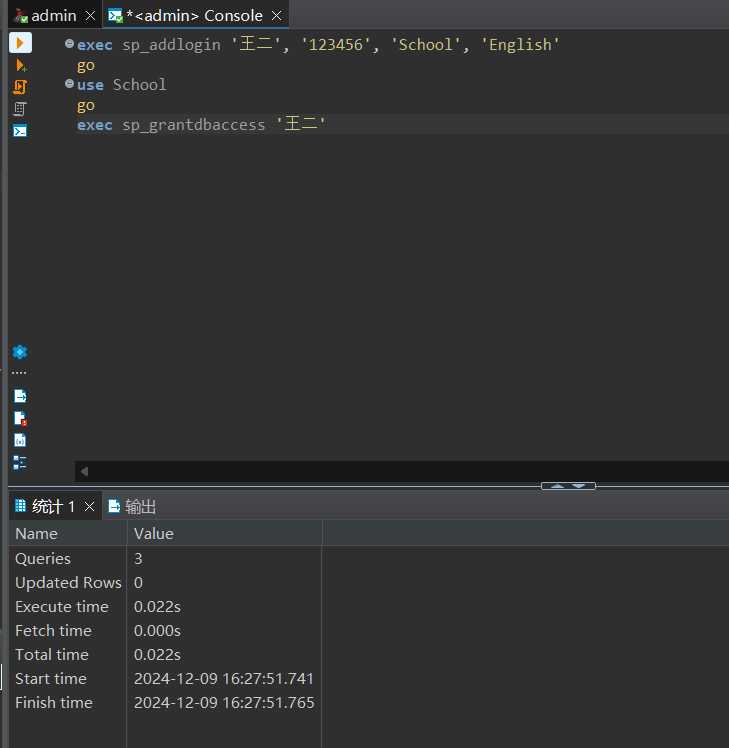

```sql
USE School;
GO

-- 创建视图 grade2000
CREATE VIEW grade2000 AS
SELECT sid, sname, email, grade
FROM students
WHERE grade = 2000;
GO
```
**CREATE VIEW grade2000 AS**：创建一个名为 `grade2000` 的视图。

**SELECT sid, sname, email, grade FROM students WHERE grade = 2000;**：从 `students` 表中选择年级为2000的学生记录，并将这些记录放入视图 `grade2000` 中。

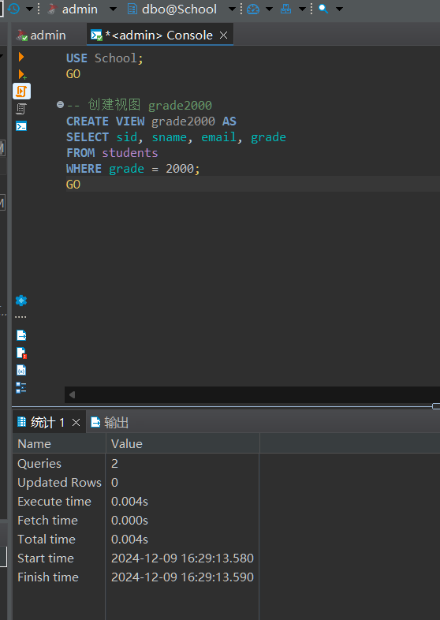

查询验证
```sql
SELECT * FROM grade2000;
```
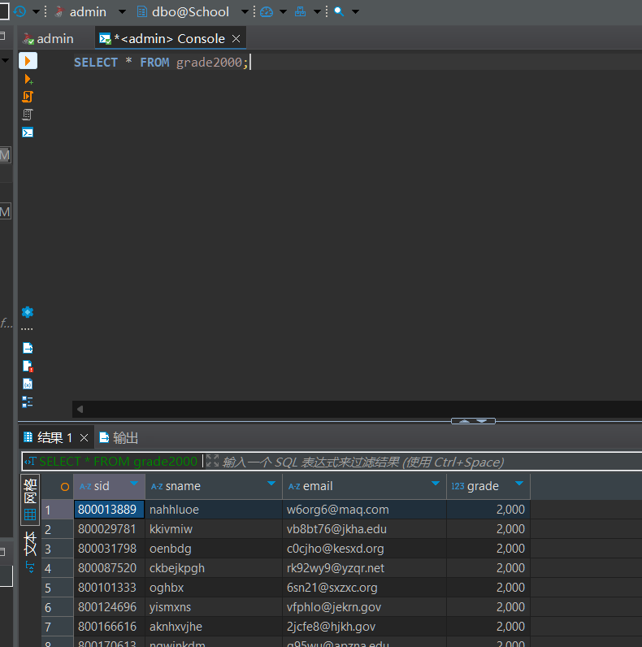

# 2.授予用户王二在视图grade2000的select权限。


```sql
USE School;
GO

-- 授予用户王二在视图 grade2000 的 SELECT 权限
GRANT SELECT ON grade2000 TO 王二;
GO
```

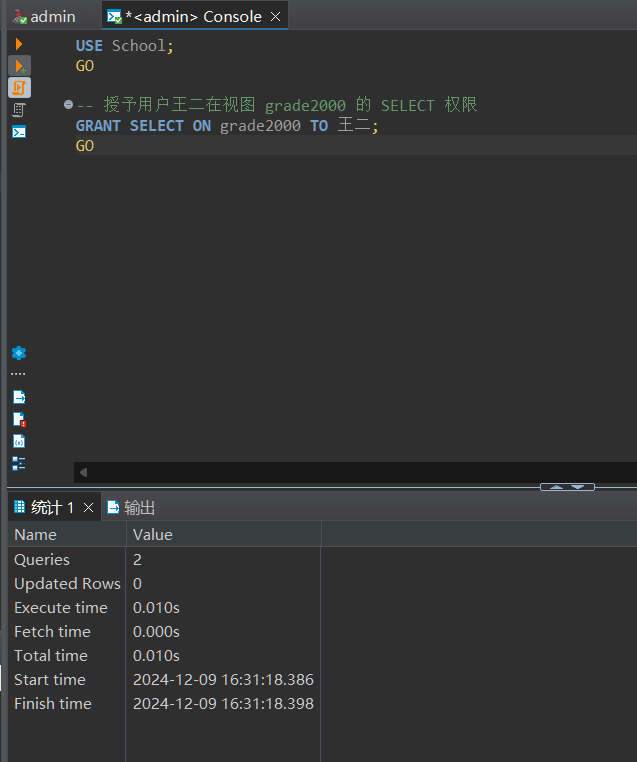

王二查询视图成功
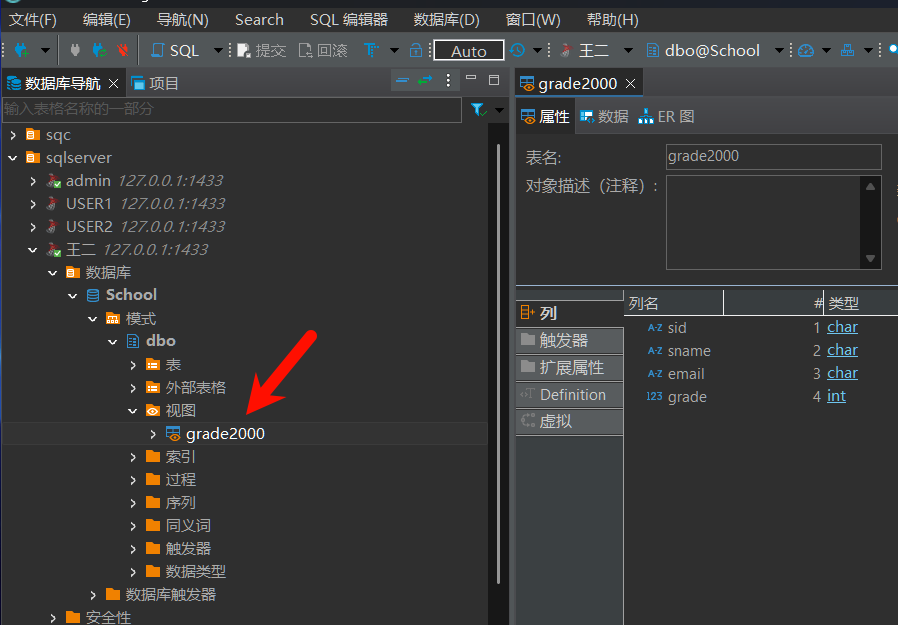


# 3.授予用户王二在视图grade2000的修改sname列的权限。


```sql
USE School;
GO

-- 授予用户王二在视图 grade2000 的 UPDATE 权限，仅限于 sname 列
GRANT UPDATE(sname) ON grade2000 TO 王二;
GO
```
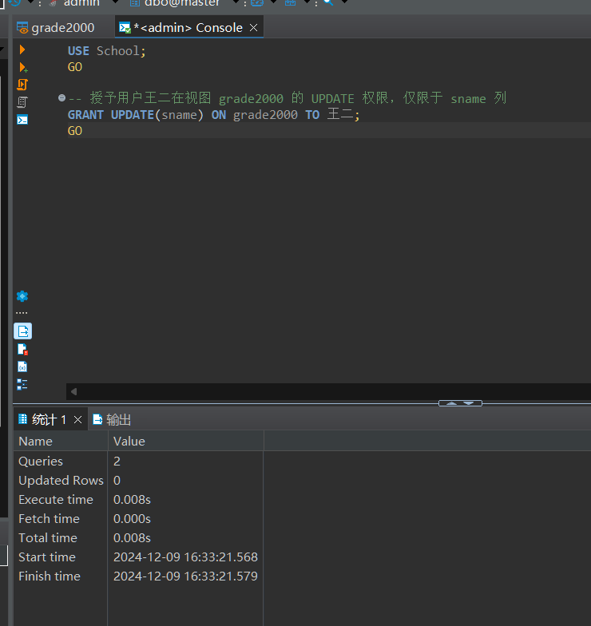

验证王二改`sname`
```sql
UPDATE grade2000 SET sname = '233' WHERE sid = '800013889';
```
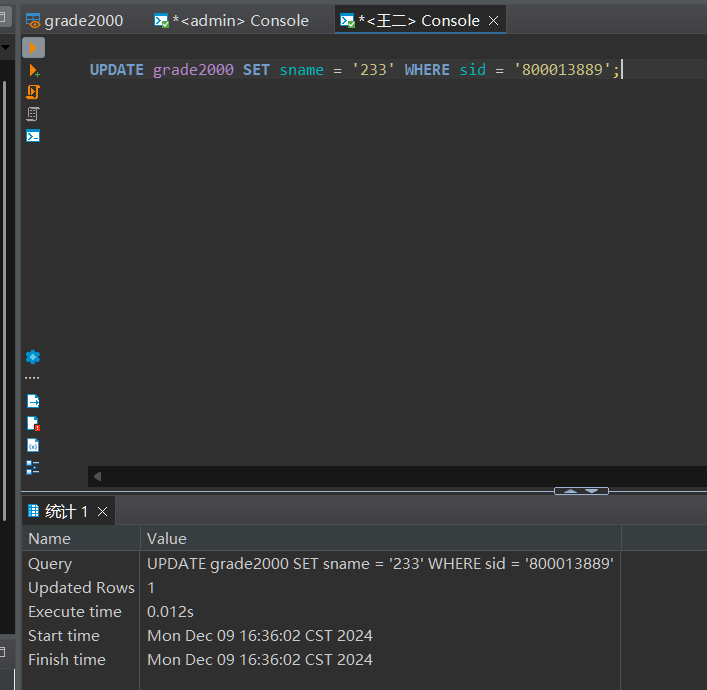
验证王二改其他列
```sql
UPDATE grade2000 SET email = '233@qq.com' WHERE sid = '800013889';
```
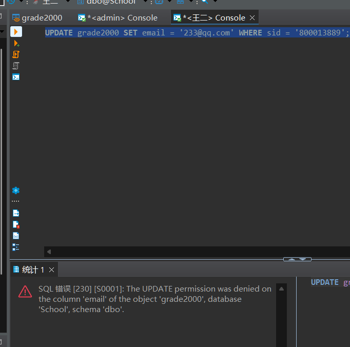

# 4.查看SQL Server错误日志。

查看所有日志
```sql
DBCC LOG ('School', -1);
```
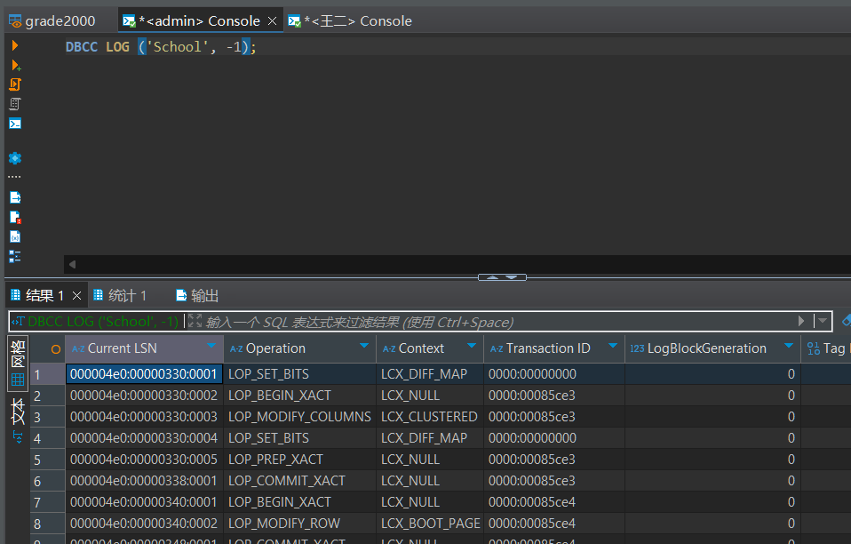

查看错误日志
```sql
EXEC sp_readerrorlog;
```
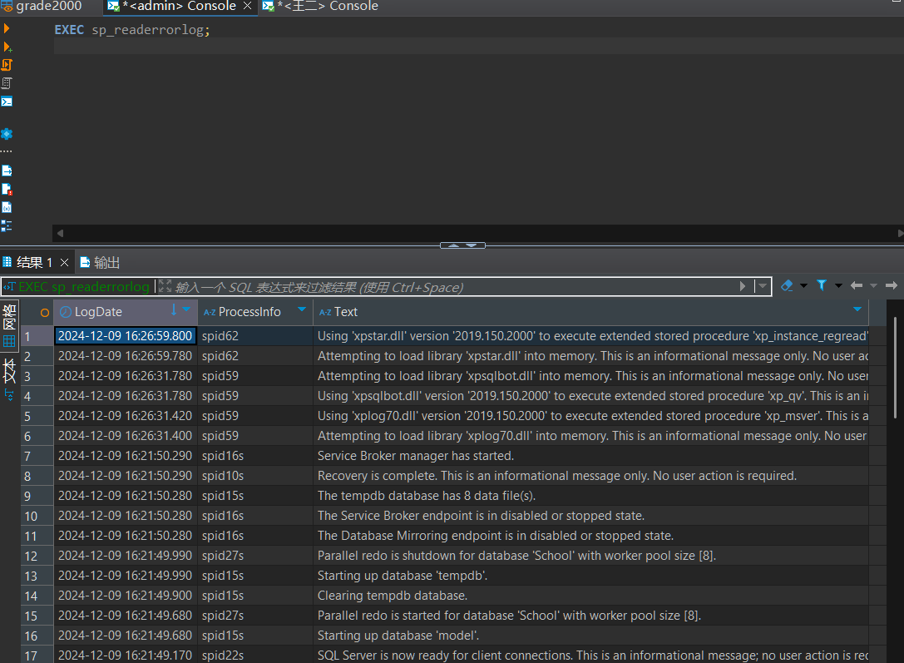

或者用GUI查看日志

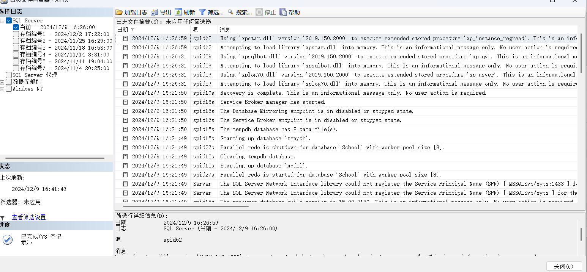