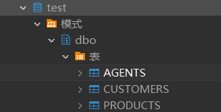
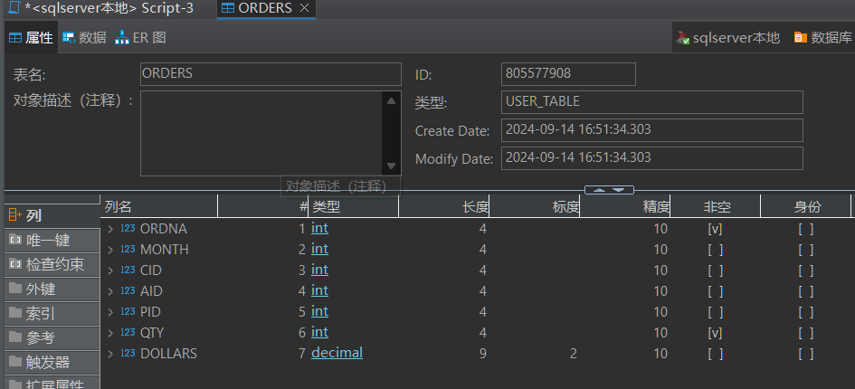
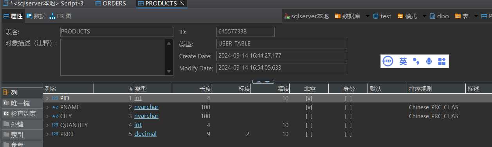
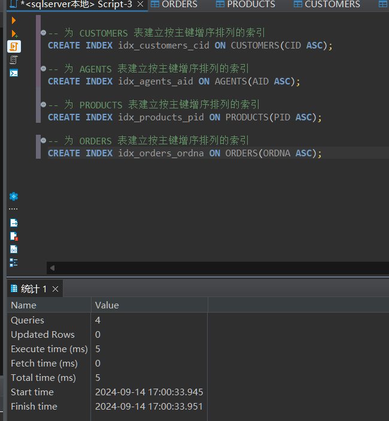
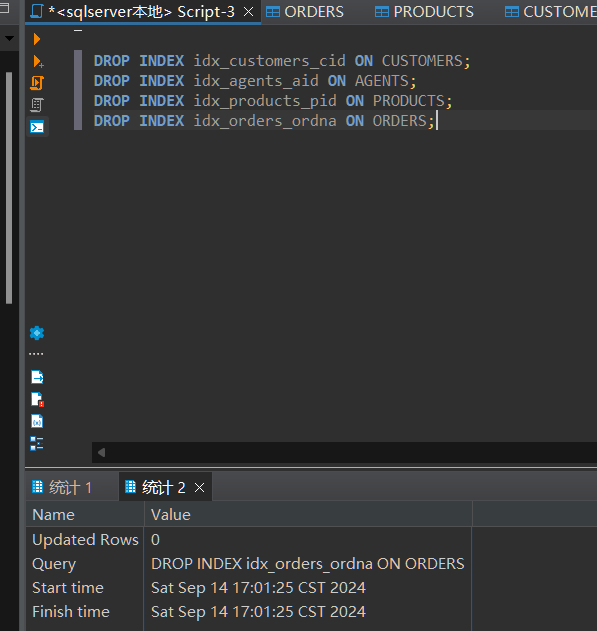
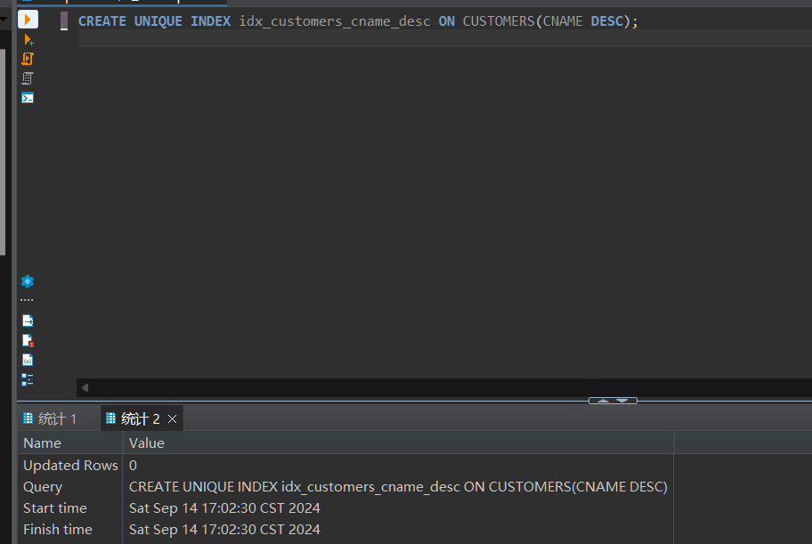
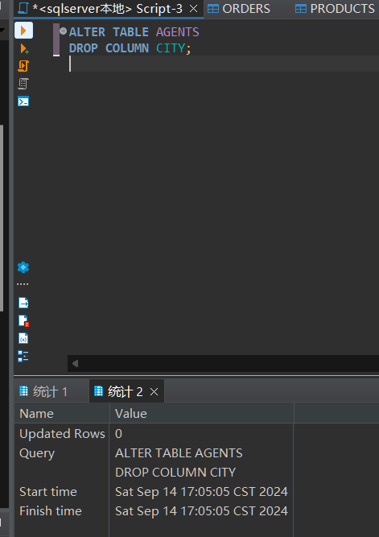
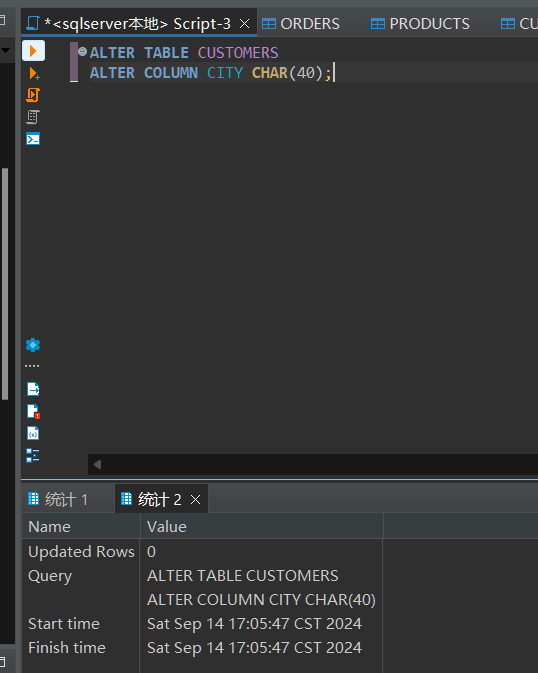
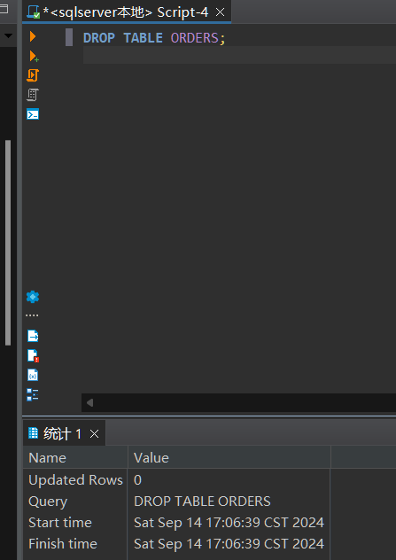

姓名：胡瑞康
学号：22336087

# (1)创建数据库表 CUSTOMERS(CID, CNAME,CITY, DISCNT)，数据库表AGENTS(AID, ANAME,CITY, PERCENT)，数据库表 PRODUCTS(PID. PNAME)，其中，CID，AID, PID分别是各表的主键，具有唯一性约束，表AGENTS中的PERCENT属性具有小于100的约束。

使用下面sql完成
```sql
-- 创建 CUSTOMERS 表
CREATE TABLE CUSTOMERS (
    CID INT PRIMARY KEY,  -- 主键，具有唯一性约束
    CNAME NVARCHAR(100) NOT NULL,
    CITY NVARCHAR(100),
    DISCNT DECIMAL(5, 2)
);

-- 创建 AGENTS 表
CREATE TABLE AGENTS (
    AID INT PRIMARY KEY,  -- 主键，具有唯一性约束
    ANAME NVARCHAR(100) NOT NULL,
    CITY NVARCHAR(100),
    [PERCENT] DECIMAL(5, 2) CHECK ([PERCENT] < 100)  -- PERCENT 属性小于100的约束，因为是保留字，所以要[]
);

-- 创建 PRODUCTS 表
CREATE TABLE PRODUCTS (
    PID INT PRIMARY KEY,  -- 主键，具有唯一性约束
    PNAME NVARCHAR(100) NOT NULL
);
```

使用DBeaver执行后得到结果如图：创建成功



# (2) 创建数据库表 ORDERS( ORDNA, MONTH,CID,AID,PID,QTY, DOLLARS)。其中， ORDNA是主键，具有唯一性约束。CID，AID，PID是外键，分别参照的是表 CUSTOMERS的CID字段，表 AGENTS的AID字段，表 PRODUCTS的PID字段。

使用下面sql完成
```sql
-- 创建 ORDERS 表
CREATE TABLE ORDERS (
    ORDNA INT PRIMARY KEY,  -- 主键，具有唯一性约束
    [MONTH] INT,            -- 注意 MONTH 是保留字，使用 [] 括起来
    CID INT,                -- 外键，引用 CUSTOMERS 表的 CID 字段
    AID INT,                -- 外键，引用 AGENTS 表的 AID 字段
    PID INT,                -- 外键，引用 PRODUCTS 表的 PID 字段
    QTY INT NOT NULL,       -- 订单数量
    DOLLARS DECIMAL(10, 2), -- 订单金额，保留两位小数
    FOREIGN KEY (CID) REFERENCES CUSTOMERS(CID),  -- CID 外键
    FOREIGN KEY (AID) REFERENCES AGENTS(AID),     -- AID 外键
    FOREIGN KEY (PID) REFERENCES PRODUCTS(PID)    -- PID 外键
);
```
使用DBeaver执行后得到结果如图：创建成功




# (3)增加数据库表 PRODUCTS的三个属性列：CITY, QUANTITY, PRICE。

使用alter语句完成

```sql
-- 向 PRODUCTS 表中增加三个属性列 CITY, QUANTITY, PRICE
ALTER TABLE PRODUCTS
ADD CITY NVARCHAR(100),      -- 城市列
    QUANTITY INT,            -- 数量列
    PRICE DECIMAL(10, 2);    -- 价格列，保留两位小数
```
使用DBeaver执行后得到结果如图：多了要求的三列



# (4)为以上4个表建立各自的按主键增序排列的索引。

使用`create index`语句，`asc`代表升序，`desc`代表降序，这里使用`asc`。

```sql
-- 为 CUSTOMERS 表建立按主键增序排列的索引
CREATE INDEX idx_customers_cid ON CUSTOMERS(CID ASC);

-- 为 AGENTS 表建立按主键增序排列的索引
CREATE INDEX idx_agents_aid ON AGENTS(AID ASC);

-- 为 PRODUCTS 表建立按主键增序排列的索引
CREATE INDEX idx_products_pid ON PRODUCTS(PID ASC);

-- 为 ORDERS 表建立按主键增序排列的索引
CREATE INDEX idx_orders_ordna ON ORDERS(ORDNA ASC);
```




# (5)取消步骤(4)建立的4个索引。

使用`drop index`语句完成

```sql
DROP INDEX idx_customers_cid ON CUSTOMERS;
DROP INDEX idx_agents_aid ON AGENTS;
DROP INDEX idx_products_pid ON PRODUCTS;
DROP INDEX idx_orders_ordna ON ORDERS;
```



# (6)创建表CUSTOMERS的按CNAME降序排列的唯一性索引。

使用`create unique index`语句完成

```sql
CREATE UNIQUE INDEX idx_customers_cname_desc ON CUSTOMERS(CNAME DESC);
```



# (7)删除步骤(3)创建的表AGENTS中的CITY属性。

使用`alter table`和`drop column`语句完成

```sql
ALTER TABLE AGENTS
DROP COLUMN CITY;
```



# (8) 修改表CUSTOMERS中CITY属性为CHAR(40)

使用`alter table`和`alter column`语句完成

```sql
ALTER TABLE CUSTOMERS
ALTER COLUMN CITY CHAR(40);
```



# (9)删除步骤(1)创建的表ORDERS

使用`drop table`语句完成

```sql
DROP TABLE ORDERS;
```



