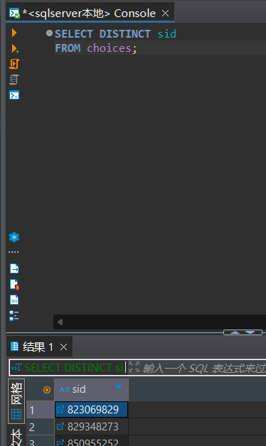
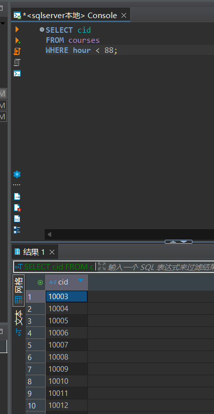
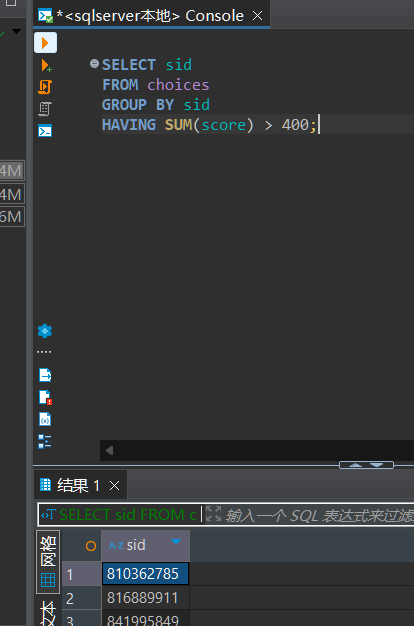
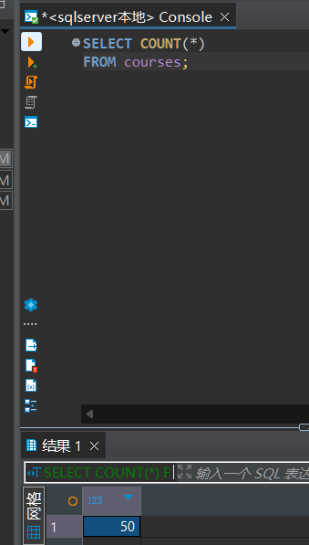
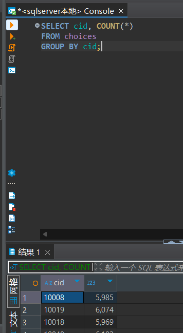
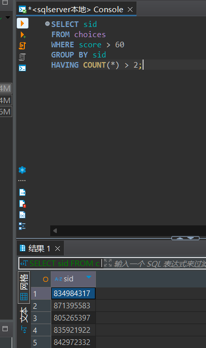
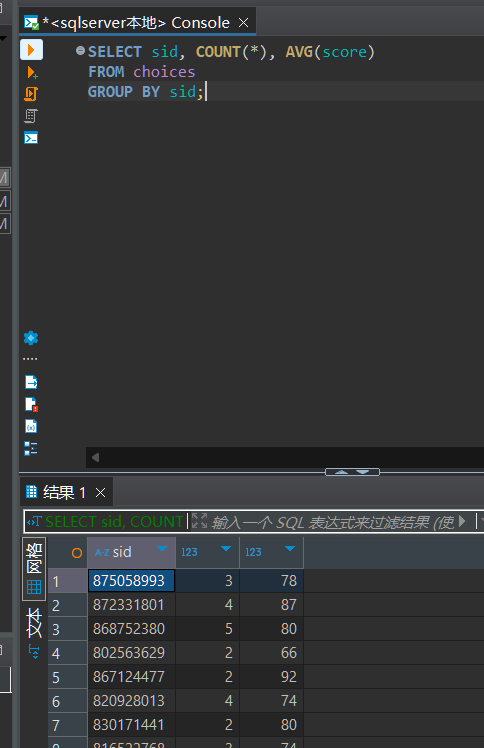
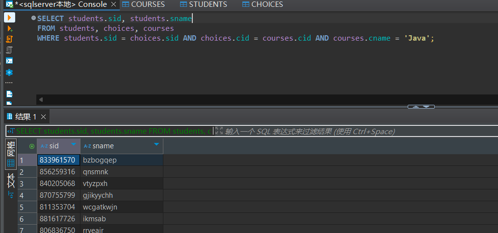
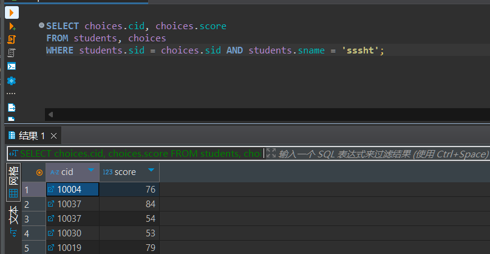
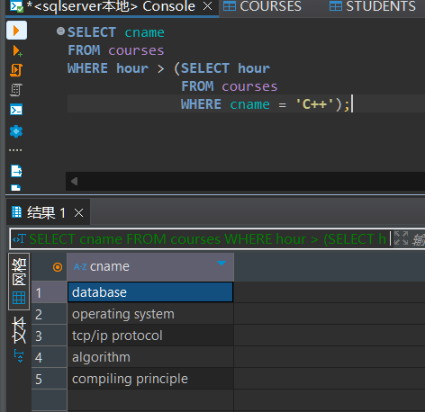

### 实验报告

**姓名：胡瑞康**
**学号：22336087**

#### 数据库表结构
- **students (sid, sname, email, grade)**
  学生表，包含学生的编号、姓名、邮箱和年级。
- **teachers (tid, tname, email, salary)**
  教师表，包含教师的编号、姓名、邮箱和薪水。
- **courses (cid, cname, hour)**
  课程表，包含课程的编号、名称和课时。
- **choices (no, sid, tid, cid, score)**
  选课表，包含选课记录的编号、学生编号、教师编号、课程编号和成绩。

---

#### (1) 查询全部课程的详细记录
```sql
SELECT *
FROM courses;
```
查询并显示所有课程的详细信息，包括课程编号、课程名称和课时。


---

#### (2) 查询所有有选修课的学生的编号
```sql
SELECT DISTINCT sid
FROM choices;
```
查询并显示所有有选修课程的学生的编号，使用 `DISTINCT` 关键字去除重复的学生编号。



---

#### (3) 查询课时<88(小时)的课程的编号
```sql
SELECT cid
FROM courses
WHERE hour < 88;
```
查询并显示课时小于88小时的课程编号。



---

#### (4) 请找出总分超过400分的学生
```sql
SELECT sid
FROM choices
GROUP BY sid
HAVING SUM(score) > 400;
```
查询并显示总分超过400分的学生编号，通过 `GROUP BY` 和 `HAVING` 子句对学生进行分组并筛选出总分超过400分的学生。



---

#### (5) 查询课程的总数
```sql
SELECT COUNT(*)
FROM courses;
```
查询并显示课程的总数，使用 `COUNT(*)` 函数统计课程表中的记录数。



---

#### (6) 查询所有课程和选修该课程的学生总数
```sql
SELECT courses.cid, courses.cname, COUNT(choices.sid) AS snum
FROM courses
LEFT JOIN choices ON courses.cid = choices.cid
GROUP BY courses.cid, courses.cname;
```
查询并显示所有课程的详细信息（包括课程编号、课程名称和课时）以及选修该课程的学生总数，并将其命名为 `snum`。通过 `LEFT JOIN` 操作连接 `courses` 和 `choices` 表，确保即使某门课程没有学生选修也能显示课程信息。使用 `GROUP BY` 对课程进行分组，并使用 `COUNT` 函数统计每组的学生数。



---

#### (7) 查询选修成绩超过60的课程超过两门的学生编号
```sql
SELECT sid
FROM choices
WHERE score > 60
GROUP BY sid
HAVING COUNT(*) > 2;
```
查询并显示选修成绩超过60分的课程超过两门的学生编号，通过 `WHERE` 子句筛选出成绩超过60分的记录，再通过 `GROUP BY` 和 `HAVING` 子句筛选出选修课程数超过两门的学生。



---

#### (8) 统计各个学生的选修课程数目和平均成绩
```sql
SELECT sid, COUNT(*), AVG(score)
FROM choices
GROUP BY sid;
```
查询并显示每个学生的选修课程数目和平均成绩，通过 `GROUP BY` 对学生进行分组，并使用 `COUNT(*)` 和 `AVG(score)` 函数分别统计选课数和平均成绩。



---

#### (9) 查询选修Java的所有学生的编号及姓名
```sql
SELECT students.sid, students.sname
FROM students, choices, courses
WHERE students.sid = choices.sid AND choices.cid = courses.cid AND courses.cname = 'Java';
```
查询并显示选修Java课程的所有学生的编号和姓名，通过多表连接 (`students`, `choices`, `courses`) 并使用 `WHERE` 子句筛选出选修Java课程的学生。



---

#### (10) 查询姓名为sssht的学生所选的课程的编号和成绩
```sql
SELECT choices.cid, choices.score
FROM students, choices
WHERE students.sid = choices.sid AND students.sname = 'sssht';
```
查询并显示姓名为sssht的学生所选课程的编号和成绩，通过多表连接 (`students`, `choices`) 并使用 `WHERE` 子句筛选出指定学生的选课记录。



---

#### (11) 查询其他课时比课程C++多的课程的名称
```sql
SELECT cname
FROM courses
WHERE hour > (SELECT hour
              FROM courses
              WHERE cname = 'C++');
```
查询并显示课时比C++课程多的其他课程的名称，通过子查询获取C++课程的课时，并在主查询中筛选出课时大于该值的课程。



