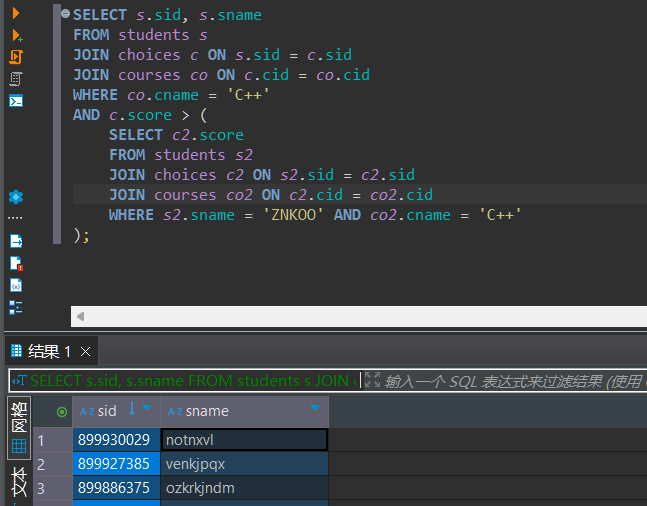
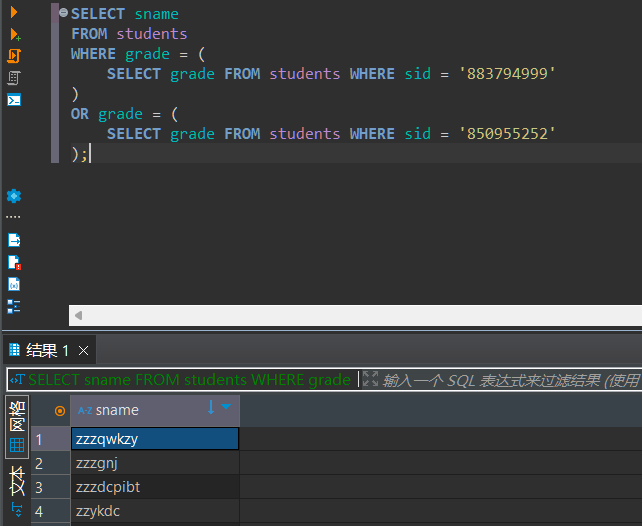
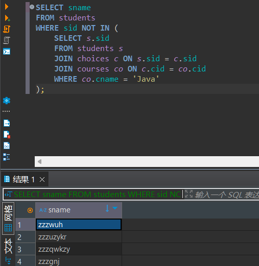
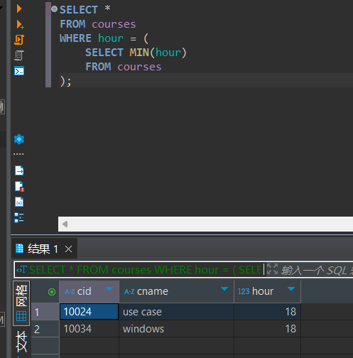
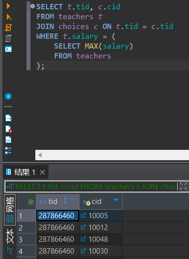
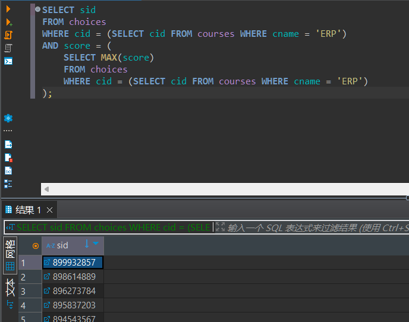
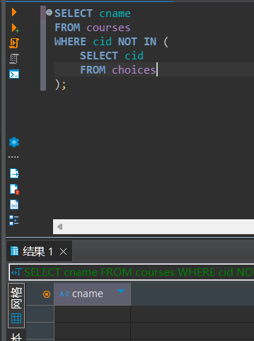
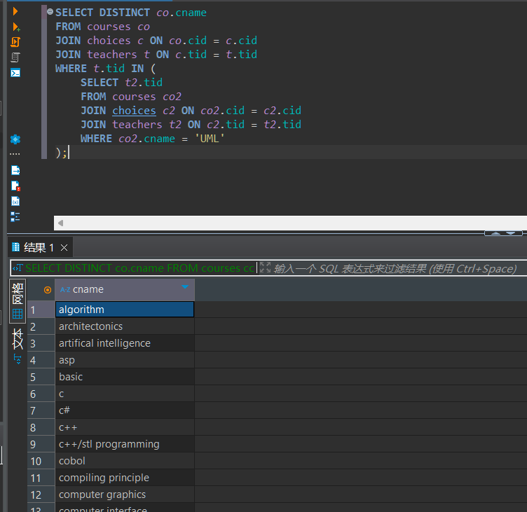
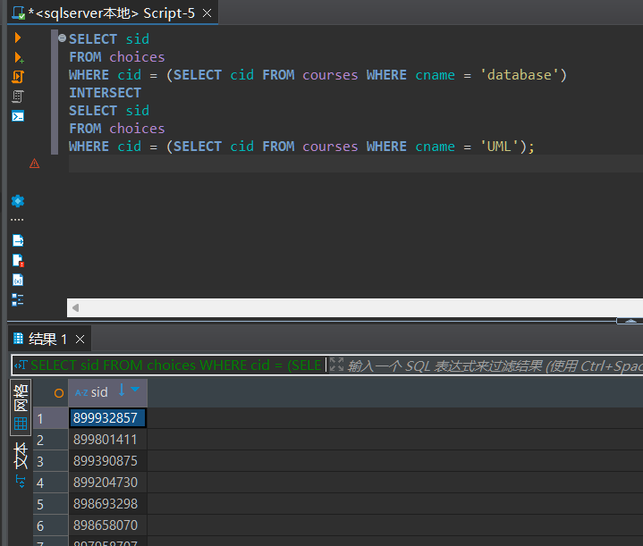
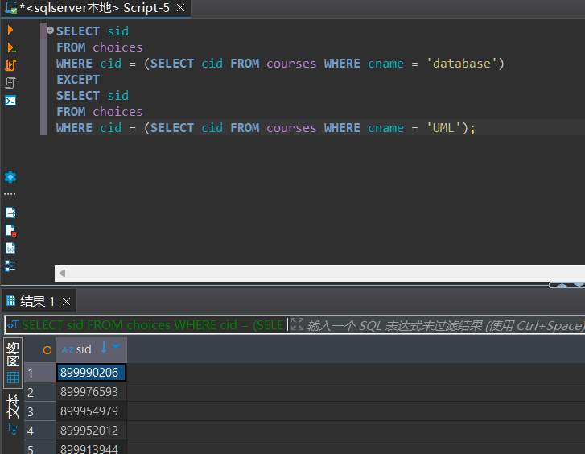

# 实验报告

**姓名：胡瑞康**
**学号：22336087**

## 数据库表结构
- **students (sid, sname, email, grade)**
  学生表，包含学生的编号、姓名、邮箱和年级。
- **teachers (tid, tname, email, salary)**
  教师表，包含教师的编号、姓名、邮箱和薪水。
- **courses (cid, cname, hour)**
  课程表，包含课程的编号、名称和课时。
- **choices (no, sid, tid, cid, score)**
  选课表，包含选课记录的编号、学生编号、教师编号、课程编号和成绩。

---
## (1)查询选修C++课程的成绩比姓名为 ZNKOO的学生高的所有学生的编号和姓名;

首先获取选修C++课程的学生及其成绩，然后在子查询找到姓名为ZNKOO的学生的成绩，再比较这些成绩并输出结果。

```sql
SELECT s.sid, s.sname
FROM students s
JOIN choices c ON s.sid = c.sid
JOIN courses co ON c.cid = co.cid
WHERE co.cname = 'C++'
AND c.score > (
    SELECT c2.score
    FROM students s2
    JOIN choices c2 ON s2.sid = c2.sid
    JOIN courses co2 ON c2.cid = co2.cid
    WHERE s2.sname = 'ZNKOO' AND co2.cname = 'C++'
);
```



## (2)找出和学生883794999或学生850955252的年级一样的学生的姓名;
查找学生883794999和850955252的年级，然后找到与他们年级相同的其他学生。
```sql
SELECT sname
FROM students
WHERE grade = (
    SELECT grade FROM students WHERE sid = '883794999'
)
OR grade = (
    SELECT grade FROM students WHERE sid = '850955252'
);
```

## (3)查询没有选修Java的学生名称;
通过子查询获取选修Java的学生，排除这些学生来找到没有选修Java的学生。
```sql
SELECT sname
FROM students
WHERE sid NOT IN (
    SELECT s.sid
    FROM students s
    JOIN choices c ON s.sid = c.sid
    JOIN courses co ON c.cid = co.cid
    WHERE co.cname = 'Java'
);
```

## (4)找出课时最少的课程的详细信息;
用`min`找到课时最少的课程，然后输出其详细信息。
```sql
SELECT *
FROM courses
WHERE hour = (
    SELECT MIN(hour)
    FROM courses
);
```

## (5)查询工资最高的教师的编号和开设的课程号;
用`max`找到工资最高的教师，然后找到他开设的课程。
```sql
SELECT t.tid, c.cid
FROM teachers t
JOIN choices c ON t.tid = c.tid
WHERE t.salary = (
    SELECT MAX(salary)
    FROM teachers
);
```

## (6)找出选修课程ERP成绩最高的学生编号;
用`max`找到ERP课程成绩最高的学生，然后输出其编号。
```sql
SELECT sid
FROM choices
WHERE cid = (SELECT cid FROM courses WHERE cname = 'ERP')
AND score = (
    SELECT MAX(score)
    FROM choices
    WHERE cid = (SELECT cid FROM courses WHERE cname = 'ERP')
);
```

## (7)查询没有学生选修的课程名称;
子查询查找所有选修的课程，排除这些课程来找到没有学生选修的课程。
```sql
SELECT cname
FROM courses
WHERE cid NOT IN (
    SELECT cid
    FROM choices
);
```

## (8)查询讲授课程UML的教师所讲授的所有课程名称;
子查询找到讲授UML课程的教师，然后查询他们所讲授的所有课程名称，用`DISTINCT`去重。
```sql
SELECT DISTINCT co.cname
FROM courses co
JOIN choices c ON co.cid = c.cid
JOIN teachers t ON c.tid = t.tid
WHERE t.tid IN (
    SELECT t2.tid
    FROM courses co2
    JOIN choices c2 ON co2.cid = c2.cid
    JOIN teachers t2 ON c2.tid = t2.tid
    WHERE co2.cname = 'UML'
);
```

## (9)使用集合交运算，查询既选修了database又选修了UML课程的学生编号;
通过集合交运算`INTERSECT`，找出选修了两门课程的学生。
```sql
SELECT sid
FROM choices
WHERE cid = (SELECT cid FROM courses WHERE cname = 'database')
INTERSECT
SELECT sid
FROM choices
WHERE cid = (SELECT cid FROM courses WHERE cname = 'UML');
```

## (10)使用集合减运算，查询选修了database却没有选修UML课程的学生编号;
通过集合减运算`EXCEPT`，找出选修了database却没有选修UML课程的学生。
```sql
SELECT sid
FROM choices
WHERE cid = (SELECT cid FROM courses WHERE cname = 'database')
EXCEPT
SELECT sid
FROM choices
WHERE cid = (SELECT cid FROM courses WHERE cname = 'UML');
```
