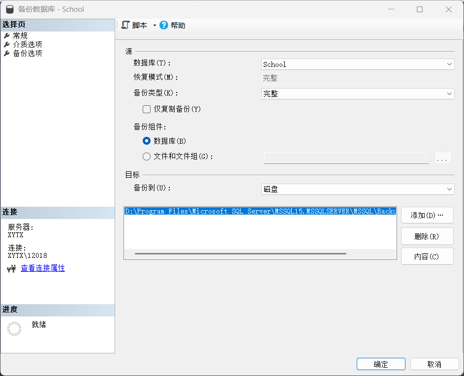
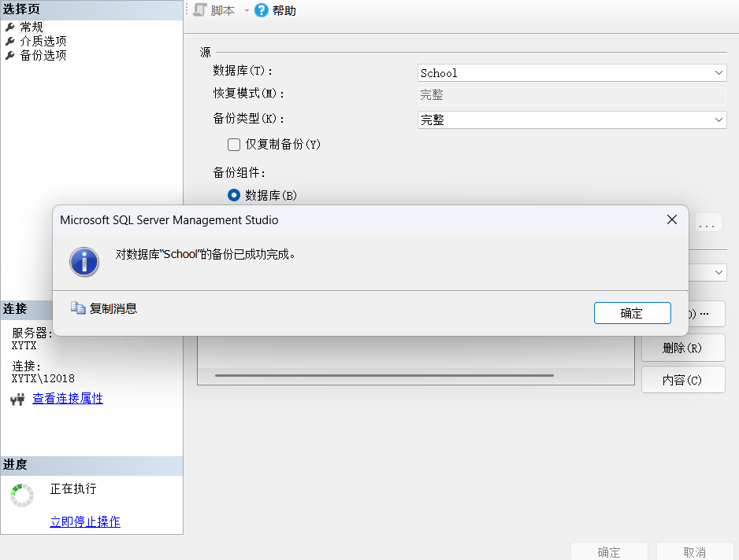
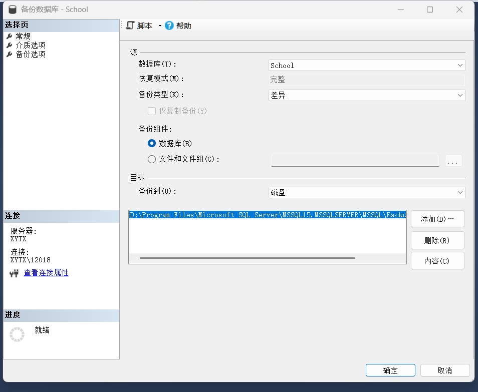
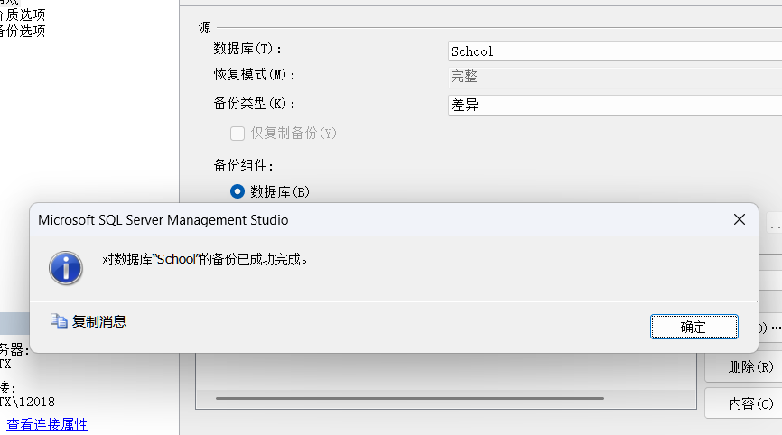
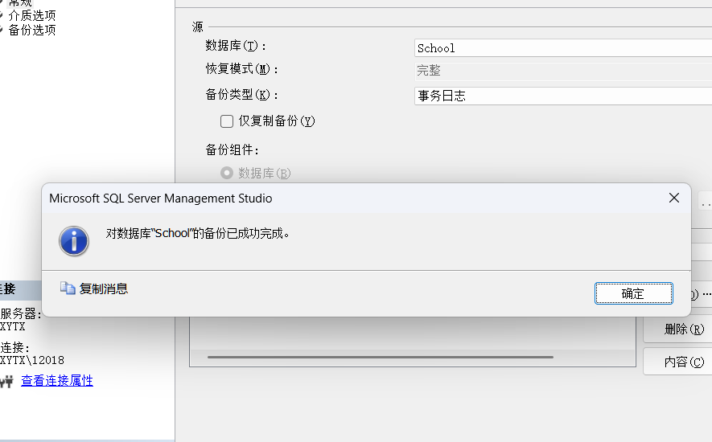
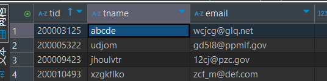
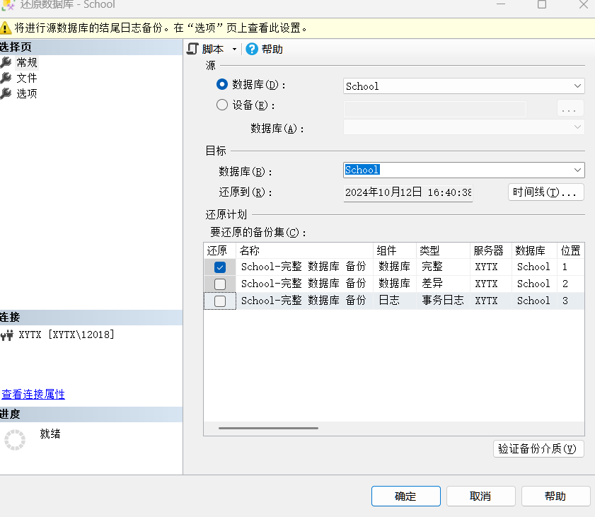
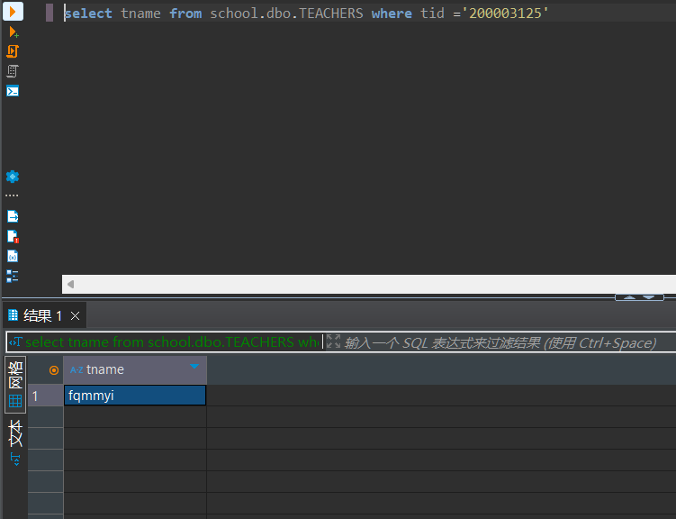

# 实验报告

**姓名：胡瑞康**
**学号：22336087**


# 1.对school数据库分别进行完整备份、差异备份和事务日志备份。

## 完整备份





## 差异备份






## 事务日志备份


# 2.对school数据库执行插入、删除或更新操作，再利用school数据库的备份进行还原，对比还原前和还原后的数据库状态。

修改如下：
```sql
UPDATE School.dbo.TEACHERS
	SET tname=N'abcde'
	WHERE tid=N'200003125 ';
```


进行恢复


恢复后tname变回原样

