# 实验报告

**姓名：胡瑞康**
**学号：22336087**

## (1) 定义选课信息和课程名称的视图 VIEWC
通过视图 `VIEWC`，可以查询到所有选课信息与课程名称的关联信息。将 `choices` 表和 `courses` 表关联，以显示学生的选课记录与相应的课程名称。

**SQL：**
```sql
CREATE VIEW VIEWC AS
SELECT c.no, c.sid, c.tid, co.cname, c.score
FROM choices c
JOIN courses co ON c.cid = co.cid;
```
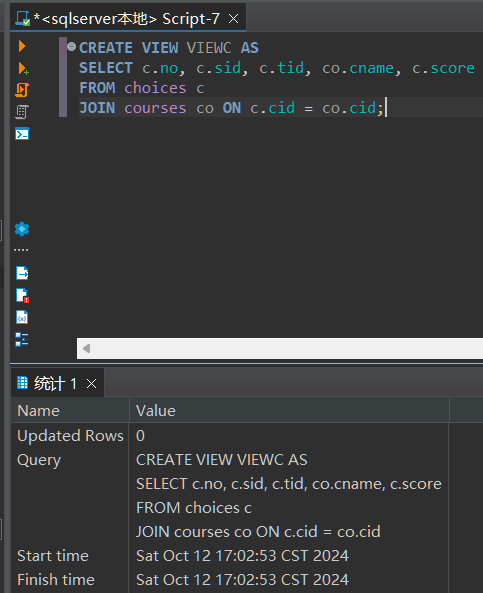

## (2) 定义学生姓名与选课信息的视图 VIEWS
通过视图 `VIEWS`，可以看到学生的姓名与其选课信息。将 `students` 表与 `choices` 表关联，以显示每个学生的姓名及其选修课程的记录。

**SQL：**
```sql
CREATE VIEW VIEWS AS
SELECT s.sname, c.no, c.cid, c.tid, c.score
FROM students s
JOIN choices c ON s.sid = c.sid;
```
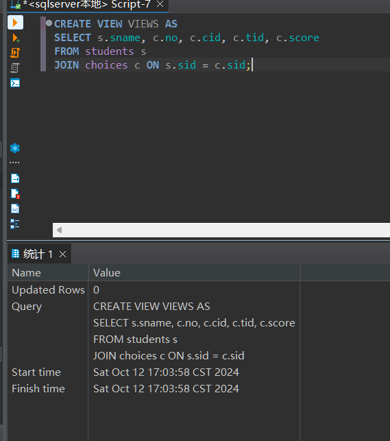
## (3) 定义年级低于1998的学生的视图 S1(SID, SNAME, GRADE)
视图 `S1` 过滤出所有年级低于1998的学生，视图显示学生的编号、姓名和年级。

**SQL：**
```sql
CREATE VIEW S1 AS
SELECT sid, sname, grade
FROM students
WHERE grade < 1998;
```
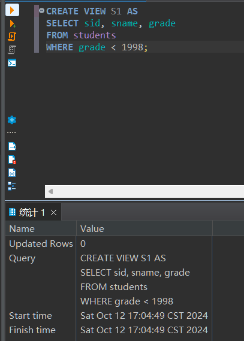
## (4) 查询学生为 “uxjof” 的学生的选课信息
需要查询学生姓名为“uxjof”的学生的所有选课信息。通过 `VIEWS` 视图可以直接进行查询。

**SQL：**
```sql
SELECT *
FROM VIEWS
WHERE sname = 'uxjof';
```
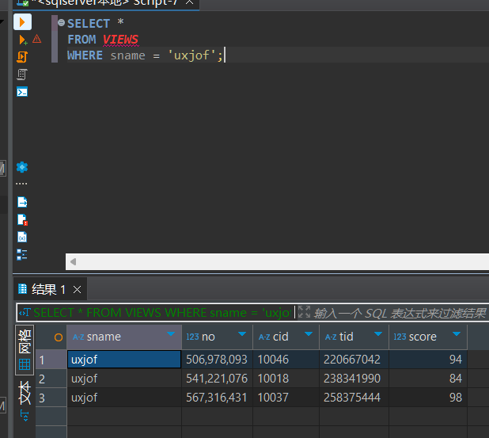
## (5) 查询选修课程 “UML” 的学生的编号和成绩
在 VIEWS 视图中，已经包含了学生姓名、选课编号、课程编号、教师编号和成绩的相关信息。因此，只需要从 VIEWS 中查找与课程 "UML" 对应的记录即可。
**SQL：**
```sql
SELECT sname, no, score
FROM VIEWS
WHERE cid = (SELECT cid FROM courses WHERE cname = 'UML');
```
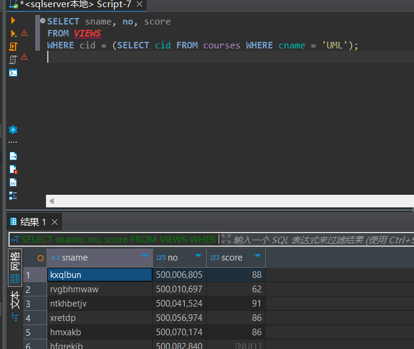
## (6) 向视图 S1 插入记录 (60000001, Lily, 2001)
尝试向视图 `S1` 插入一条新记录，该记录的学生编号为 `60000001`，姓名为 `Lily`，年级为 `2001`。

**SQL：**
```sql
INSERT INTO S1 (sid, sname, grade)
VALUES (60000001, 'Lily', 2001);
```
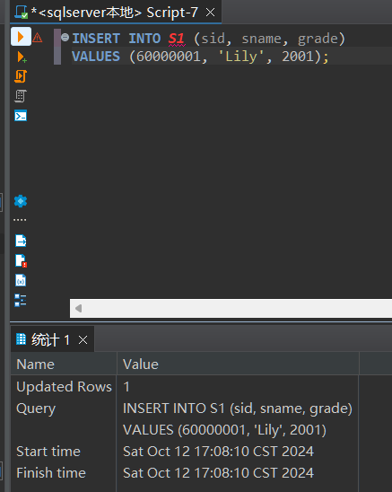
## (7) 定义包括更新和插入约束的视图 S1，并尝试插入记录 (60000001, Lily, 1997) 和删除年级为 1999 的所有学生记录


- 定义视图 `S1` 时，增加插入和更新的约束，以确保插入和更新时遵守特定规则（例如：不能插入或更新年级为1998及以下的学生）。
- 尝试插入一条年级为1997的记录，违反了插入约束。
- 讨论插入和更新约束对数据一致性和业务规则的影响。

**定义带有约束的视图：**
```sql
CREATE VIEW S1 AS
SELECT sid, sname, grade
FROM students
WHERE grade < 1998
WITH CHECK OPTION;
```

**尝试插入 (60000001, Lily, 1997)：**
```sql
INSERT INTO S1 (sid, sname, grade)
VALUES (60000001, 'Lily', 1997);
```
**结果：** 插入会失败，因为违反了视图定义的约束条件，年级必须大于1998。也违反了Student不能有重复sid。
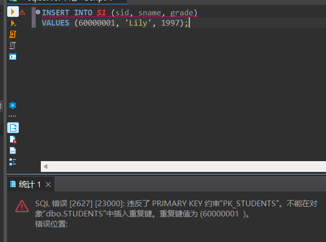

**删除年级为1999的所有学生记录：**
```sql
DELETE FROM students
WHERE grade = 1999;
```
似乎因为外键约束无法删除
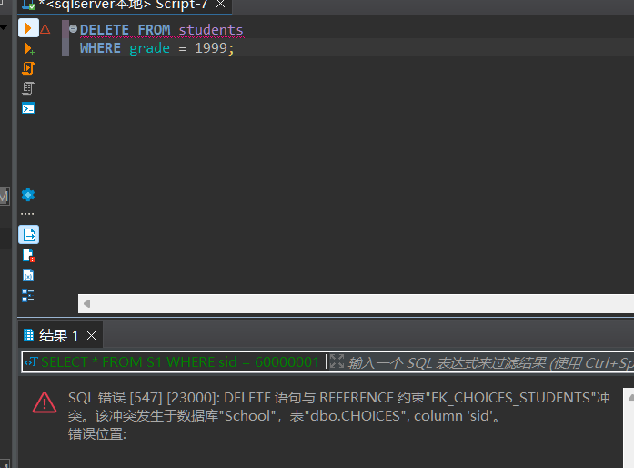
关闭约束后可以删除
```sql
-- 禁用外键约束
ALTER TABLE dbo.CHOICES NOCHECK CONSTRAINT FK_CHOICES_STUDENTS;

-- 执行删除操作
DELETE FROM students WHERE grade = 1999;

-- 重新启用外键约束
ALTER TABLE dbo.CHOICES CHECK CONSTRAINT FK_CHOICES_STUDENTS;
```
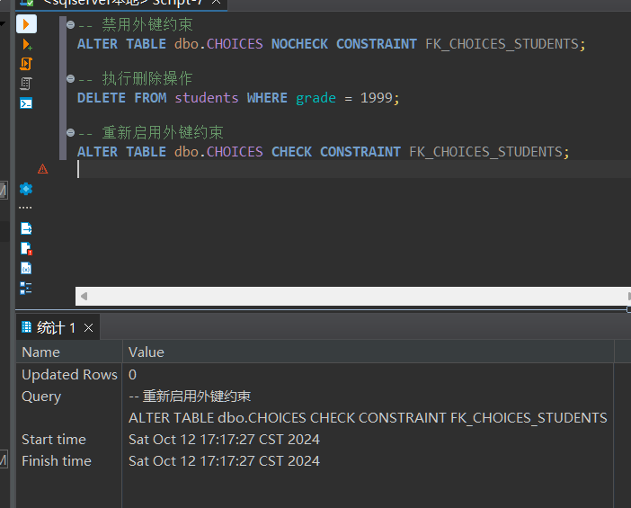
## (8) 在视图 VIEWS 中将姓名为 “uxjof” 的学生的选课成绩都加上 5 分
通过更新 `VIEWS` 视图中的记录，将姓名为“uxjof”的学生的所有选课成绩增加5分。

**SQL：**
```sql
UPDATE VIEWS
SET score = score + 5
WHERE sname = 'uxjof';
```
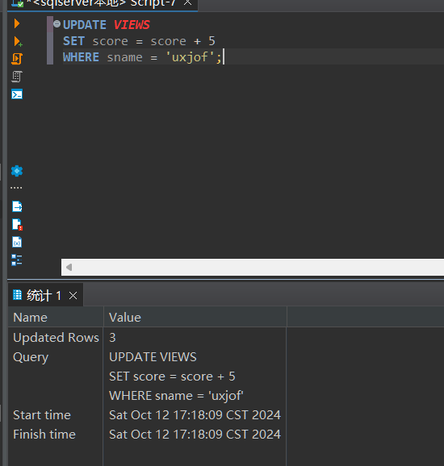
## (9) 取消以上建立的所有视图
通过 `DROP VIEW` 删除之前创建的所有视图。

**SQL：**
```sql
DROP VIEW VIEWC;
DROP VIEW VIEWS;
DROP VIEW S1;
```
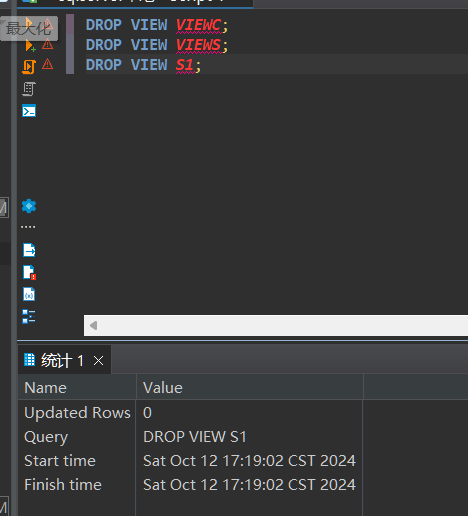