# 实验报告

**姓名：胡瑞康**
**学号：22336087**

## 数据库表结构
- **students (sid, sname, email, grade)**
  学生表，包含学生的编号、姓名、邮箱和年级。
- **teachers (tid, tname, email, salary)**
  教师表，包含教师的编号、姓名、邮箱和薪水。
- **courses (cid, cname, hour)**
  课程表，包含课程的编号、名称和课时。
- **choices (no, sid, tid, cid, score)**
  选课表，包含选课记录的编号、学生编号、教师编号、课程编号和成绩。

## 前置操作
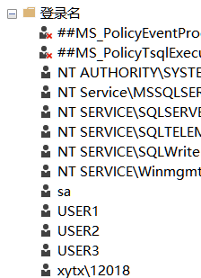
创建USER1,2,3，以及在Dbeaver设置三个用户的链接


## (1)授予所有用户对表 STUDENTS的查询权限
```sql
select * from STUDENTS
```
授予权限之前：无法查询
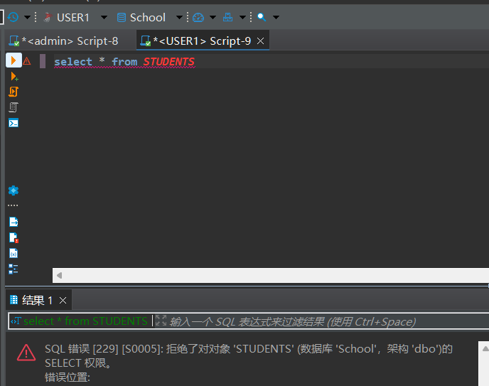
授予权限使用管理员账号执行下面的sql
```sql
GRANT SELECT ON STUDENTS TO USER1,USER2,USER3;
```
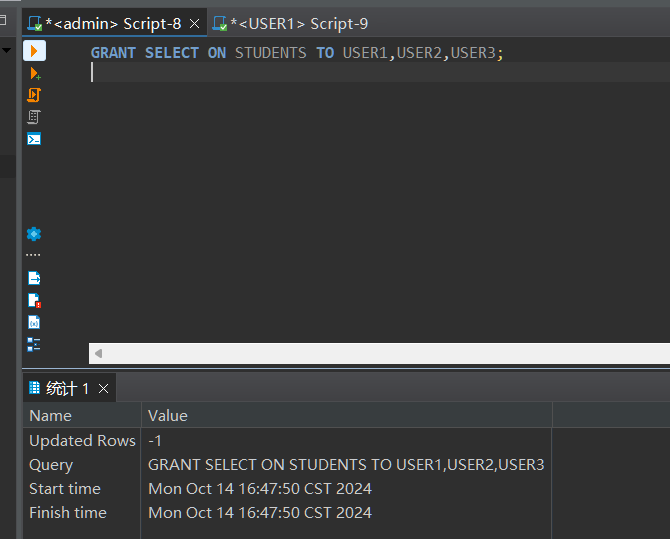
切换到USER，发现可以查询了
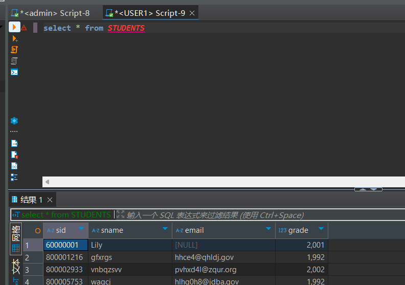
## (2)授予所有用户对表 COURSES的查询和更新权限
授予权限之前：用户无法查询
```sql
select * from COURSES
```
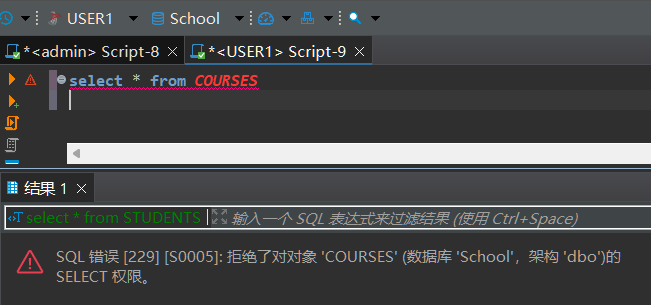
也无法更新
```sql
UPDATE COURSES SET cname=N'test' WHERE cid=N'10001';
```
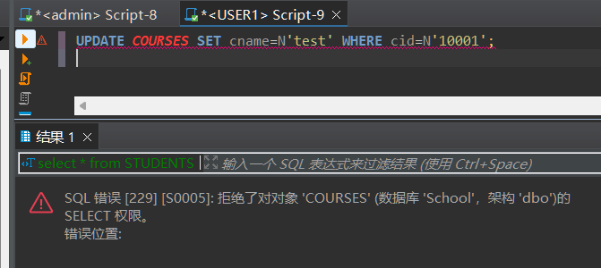
授予权限使用管理员账号执行下面的sql

```sql
GRANT SELECT,UPDATE ON COURSES TO USER1,USER2,USER3;
```

用户可以执行更新和查询：
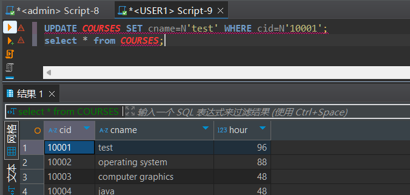


## (3)授予USER1对表 TEACHERS的查询,更新工资的权限,且允许 USERI1可以传播这些权限
授予权限之前：用户无法查询或者更新工资
```sql
select * from TEACHERS;
UPDATE TEACHERS SET salary=233 WHERE tid=N'200003125 ';
```

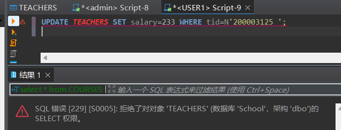
授予权限使用管理员账号执行下面的sql
```sql
GRANT SELECT, UPDATE (salary) ON TEACHERS TO USER1 WITH GRANT OPTION;
```
用户可以修改工资列以及查询
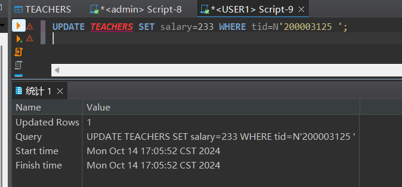
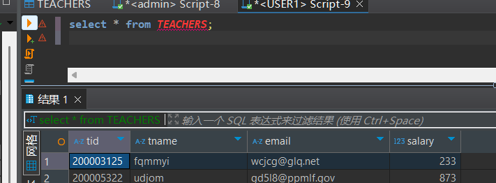
但是不能修改其他列
```sql
UPDATE TEACHERS SET tname=N'233' WHERE tid=N'200003125 ';
```
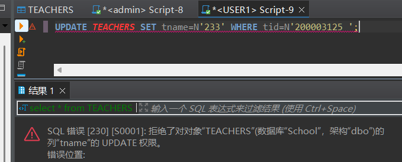

## (4)授予USER2对表 CHOICES的查询,更新成绩的权限

授予权限之前：USER2无法查询或更新成绩

```sql
select * from CHOICES;
UPDATE CHOICES SET score=90 WHERE no=500000058;
```

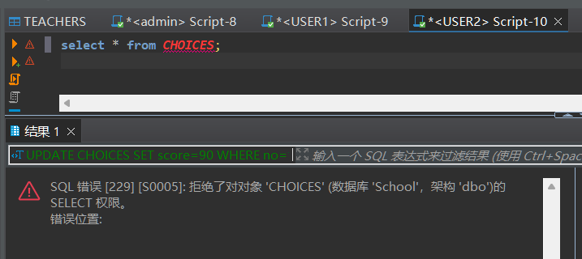
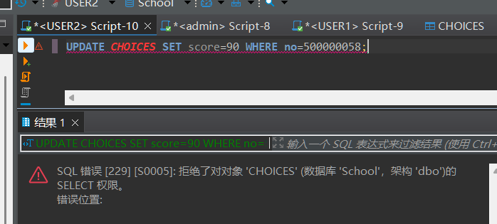

授予权限使用管理员账号执行以下SQL：

```sql
GRANT SELECT, UPDATE (score) ON CHOICES TO USER2;
```

授予权限后，切换到USER2账号，可以查询和更新成绩了：

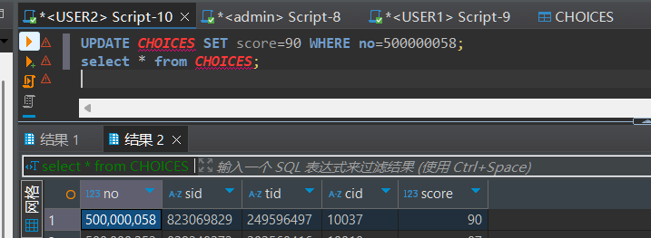


但是USER2不能修改其他列：

```sql
UPDATE CHOICES SET cid='10002' WHERE no=500000058;
```
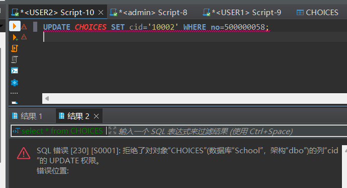

## (5)由USER1授予USER2对表 TEACHERS的查询权限和传播的此项权限的权利
授予权限之前：USER2无法查询
```sql
select * from TEACHERS;
```
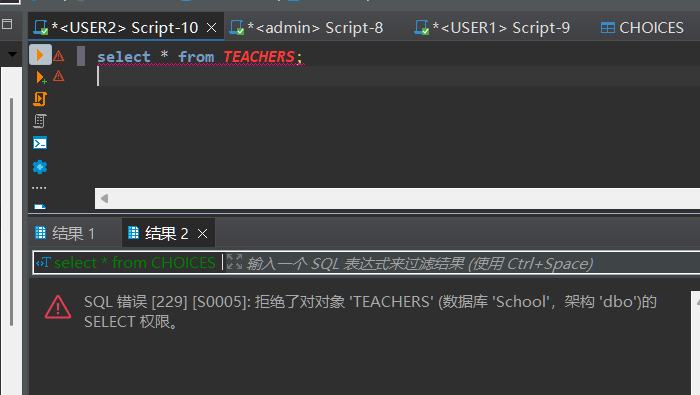
授予权限使用USER1执行以下SQL：
```sql
GRANT SELECT ON TEACHERS TO USER2 WITH GRANT OPTION;
```
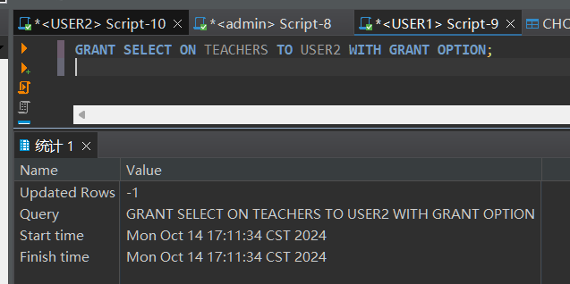
之后可以查询
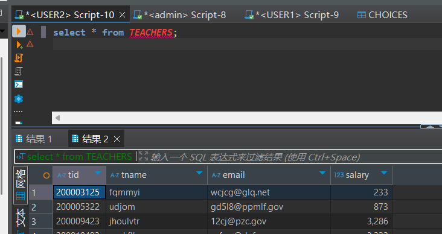
## (6)由USER2授予USER3对表 TEACHERS的查询权限,和传播的此项权限的权利。
授予权限之前：USER3无法查询
```sql
select * from TEACHERS;
```
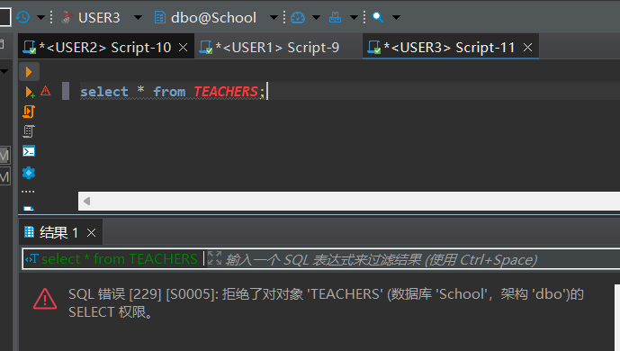
授予权限使用USER2执行以下SQL：
```sql
GRANT SELECT ON TEACHERS TO USER3 WITH GRANT OPTION;
```
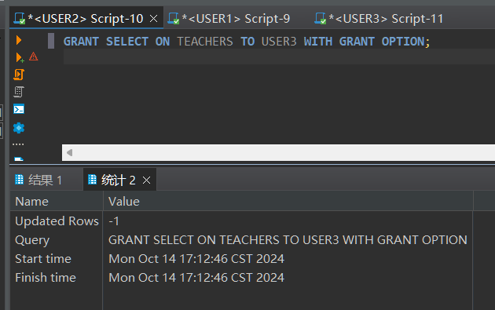
之后可以查询
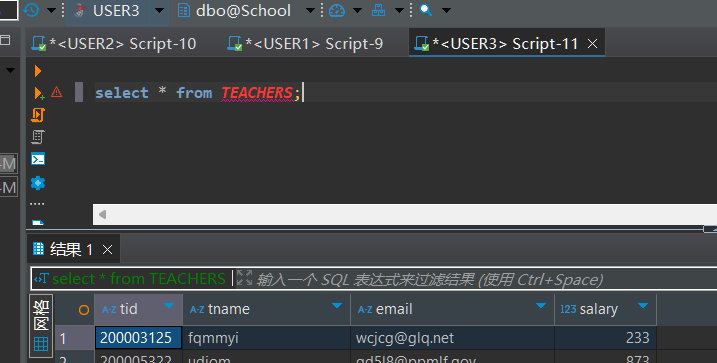

再由USER3授予USER2上述权限,这样的SQL语句能否成功得到执行?

尝试构建sql
```sql
GRANT SELECT ON TEACHERS TO USER2 WITH GRANT OPTION;
```
可以执行
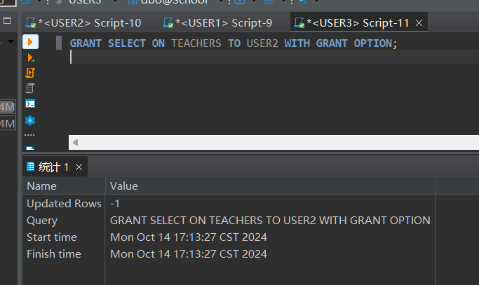
## (7)取消USER1对表 STUDENTS的查询权限,考虑由USER2的身份对表 STUDENTS 进行查询,操作能否成功?为什么？

执行下面sql取消：
```sql
REVOKE SELECT ON STUDENTS FROM USER1;
```
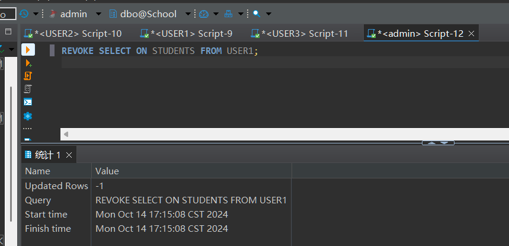
观察到USER2可以查询
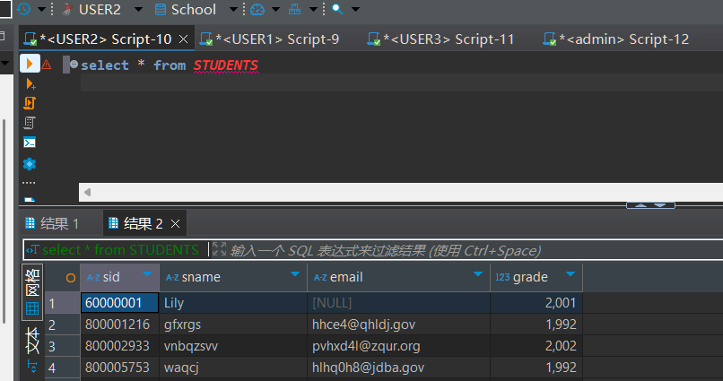
原因可能是：
USER2的查询权限是由管理员直接授予的，而不是通过USER1传递过来的。

权限传播的撤销通常只会影响通过该用户传递的权限，而不会影响直接赋予用户的权限。

## (8)取消USER1和USER2的关于表 COURSES的权限

执行下面sql取消：
```sql
REVOKE SELECT,UPDATE ON COURSES FROM USER1,USER2;
```
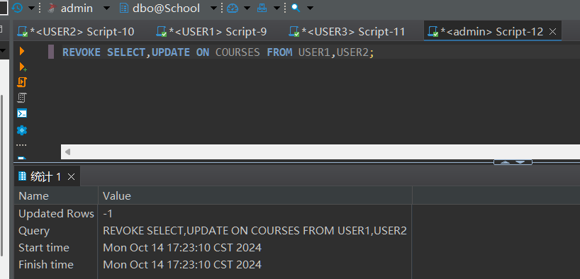
之后USER1和USER2无法查询和更新
```sql
select * from COURSES;
UPDATE COURSES SET cname=N'test' WHERE cid=N'10001';
```
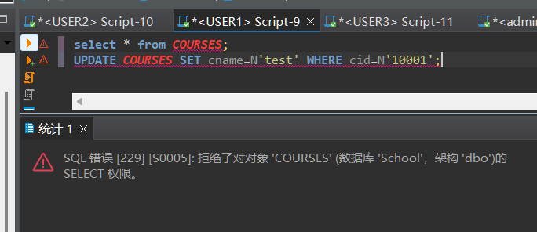
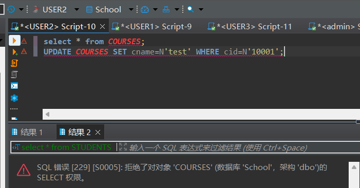