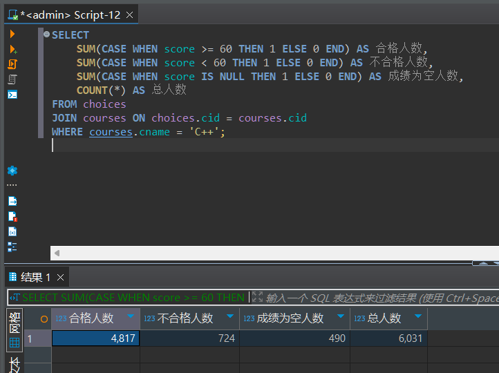
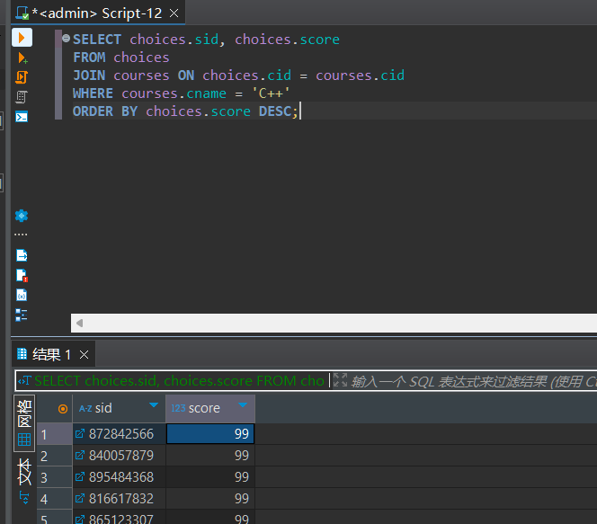
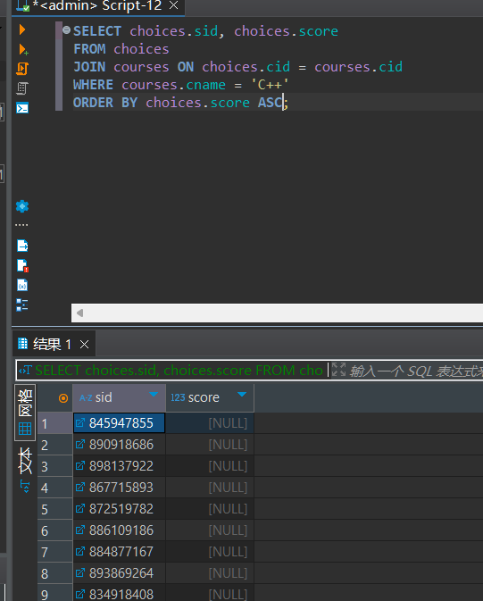
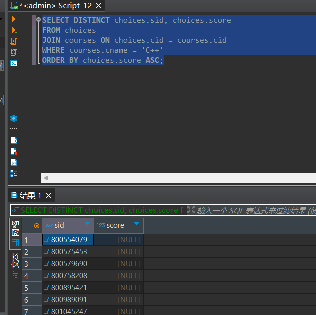
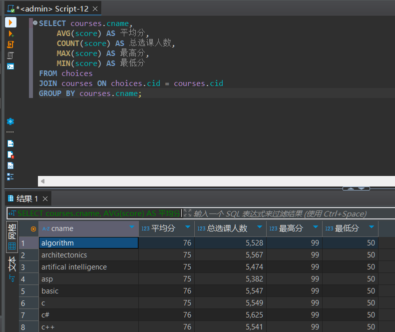
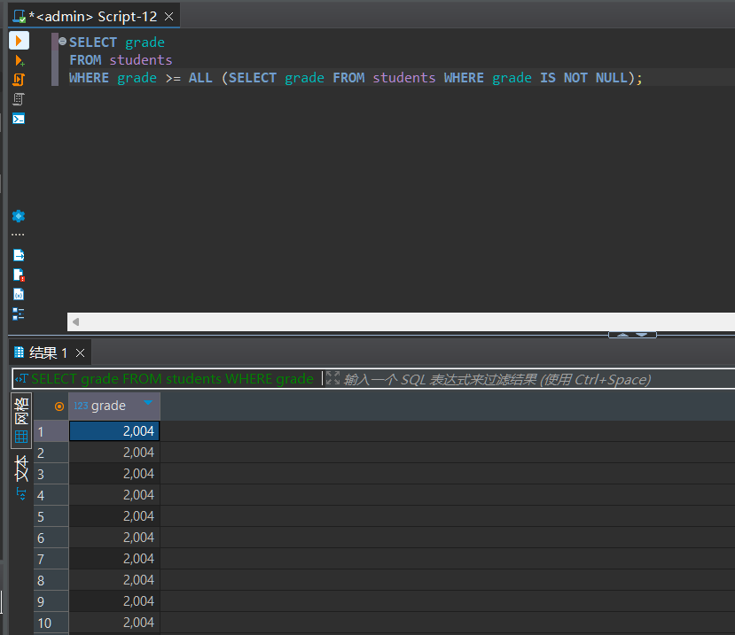

# 实验报告

**姓名：胡瑞康**
**学号：22336087**

## 数据库表结构
- **students (sid, sname, email, grade)**
  学生表，包含学生的编号、姓名、邮箱和年级。
- **teachers (tid, tname, email, salary)**
  教师表，包含教师的编号、姓名、邮箱和薪水。
- **courses (cid, cname, hour)**
  课程表，包含课程的编号、名称和课时。
- **choices (no, sid, tid, cid, score)**
  选课表，包含选课记录的编号、学生编号、教师编号、课程编号和成绩。

## (1) 查询选修课程C++的学生人数及成绩合格和不合格的学生人数，并讨论NULL值的含义

```sql
SELECT
    SUM(CASE WHEN score >= 60 THEN 1 ELSE 0 END) AS 合格人数,
    SUM(CASE WHEN score < 60 THEN 1 ELSE 0 END) AS 不合格人数,
    SUM(CASE WHEN score IS NULL THEN 1 ELSE 0 END) AS 成绩为空人数,
    COUNT(*) AS 总人数
FROM choices
JOIN courses ON choices.cid = courses.cid
WHERE courses.cname = 'C++';
```

- 说明：
  - 该查询统计了选修C++课程的学生中合格、不合格和成绩为NULL的学生人数。
  - `SUM(CASE)`用于条件统计，`score >= 60` 表示成绩合格，`score < 60` 表示不合格，`score IS NULL` 表示成绩为NULL。
  - NULL表示缺失值，可能是成绩尚未录入或学生未参加考试。

## (2) 查询选修课程C++的学生编号和成绩，按成绩排序，查看NULL项是否包含在结果中

```sql
SELECT choices.sid, choices.score
FROM choices
JOIN courses ON choices.cid = courses.cid
WHERE courses.cname = 'C++'
ORDER BY choices.score DESC;
```

- 降序的时候最前面的是最大的



- 升序的时候最前面的是最小的,NULL都在最前面



## (3) 在上面的查询的过程中，如果加上保留字 DISTINCT会有什么效果呢?

```sql
SELECT DISTINCT choices.sid, choices.score
FROM choices
JOIN courses ON choices.cid = courses.cid
WHERE courses.cname = 'C++'
ORDER BY choices.score ASC;
```

- 说明：
  - 使用 `DISTINCT` 时，会去除结果集中重复的记录。即如果某个学生多次选修C++并且成绩相同，这些重复项会被去除。
  - 如果成绩为NULL，仍会在结果集中保留，只要 `sid` 与 `score` 的组合是唯一的。


## (4) 按年级对所有学生分组，并讨论

```sql
SELECT grade, COUNT(*) AS 学生人数
FROM students
GROUP BY grade;
```

- 说明：
  - 该查询根据学生的年级对所有学生进行分组，并统计每个年级的人数。
  - 如果存在NULL值的年级（即某些学生的年级未填写），这些学生会被单独归为一组。
  - 在现实中，不应该有NULL值的年级，NULL值意味着数据不完整。

## (5) 按课程分组，使用聚合函数求每个课程的平均分、总选课人数、最高分、最低分，并讨论空值的影响

```sql
SELECT courses.cname,
    AVG(score) AS 平均分,
    COUNT(score) AS 总选课人数,
    MAX(score) AS 最高分,
    MIN(score) AS 最低分
FROM choices
JOIN courses ON choices.cid = courses.cid
GROUP BY courses.cname;
```

- 说明：
  - `AVG`、`COUNT`、`MAX` 和 `MIN` 都是聚合函数。
  - `COUNT(score)`只统计非NULL的成绩，`AVG(score)`也是忽略NULL值的。因此，成绩为空的记录不会影响平均分和总人数的计算。
  - 空值不会计入 `MAX` 和 `MIN` 的计算，表示这些函数都不考虑空值。


## (6) 使用嵌套查询和ALL谓词查询最晚入学的学生年级，讨论空值的影响

```sql
SELECT grade
FROM students
WHERE grade >= ALL (SELECT grade FROM students WHERE grade IS NOT NULL);
```

- 说明：
  - 该查询使用嵌套查询和`ALL`关键字，查询所有非空年级中的最大年级（即最晚入学的年级）。
  - 当存在年级为NULL的项时，这些项不会参与比较，因为 `ALL` 的内部子查询只选择非NULL的年级。
  - 如果所有年级都是NULL，查询结果将为空。
