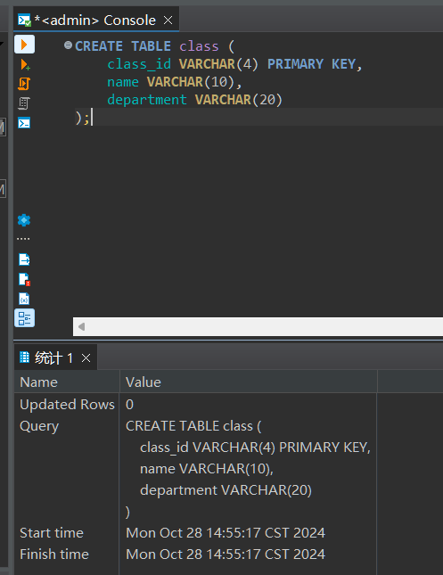
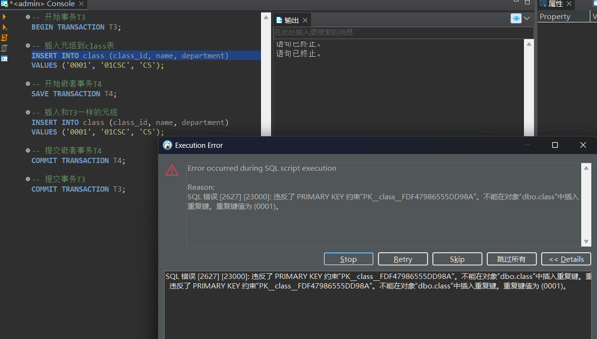
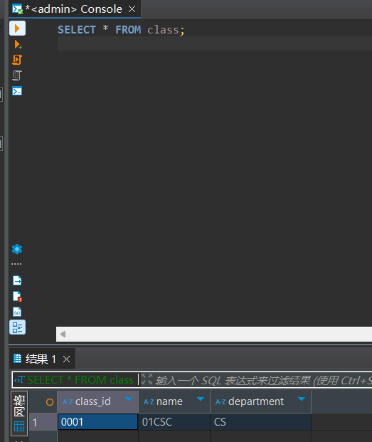
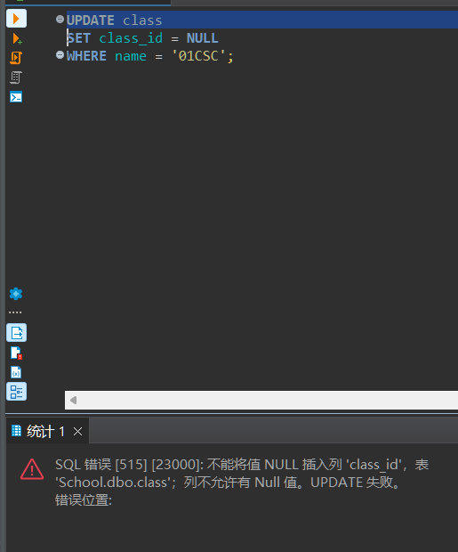
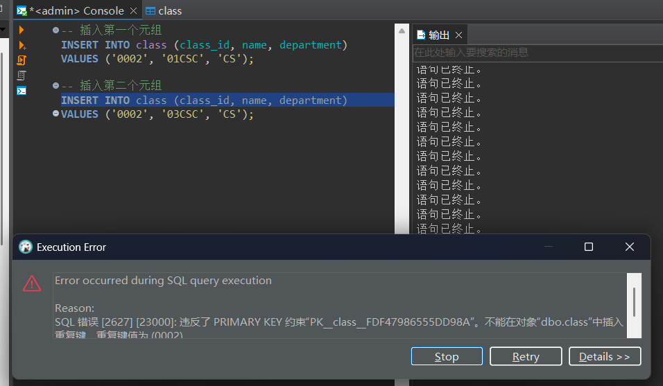
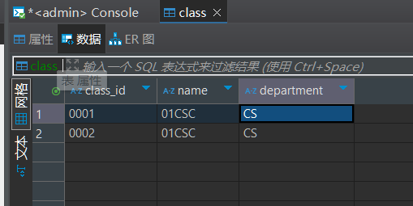
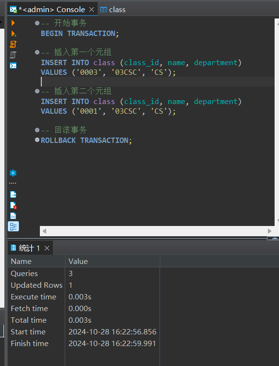
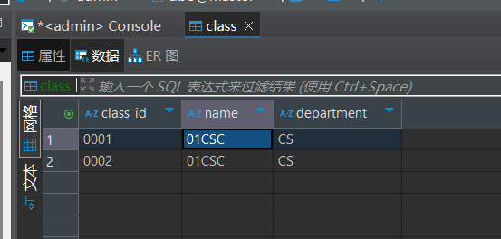
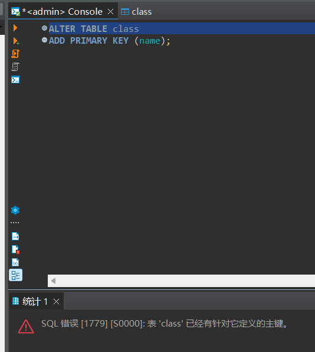

# 实验报告

**姓名：胡瑞康**
**学号：22336087**

## 数据库表结构
- **students (sid, sname, email, grade)**
  学生表，包含学生的编号、姓名、邮箱和年级。
- **teachers (tid, tname, email, salary)**
  教师表，包含教师的编号、姓名、邮箱和薪水。
- **courses (cid, cname, hour)**
  课程表，包含课程的编号、名称和课时。
- **choices (no, sid, tid, cid, score)**
  选课表，包含选课记录的编号、学生编号、教师编号、课程编号和成绩。

## 1

> 在school数据库中建立一张新表class，包括class_id(varchar(4)), name(varchar(10)), department(varchar(20))三个列，并约束class_id为主键。

按要求写下如下sql：

```sql
CREATE TABLE class (
    class_id VARCHAR(4) PRIMARY KEY,
    name VARCHAR(10),
    department VARCHAR(20)
);
```


## 2

> 创建事务T3，在事务中插入一个元组（`0001`，`01CSC`,``CS`）,并在T3中嵌套创建事务T4，T4也插入和T3一样的元组，编写代码测试，查看结果。

事务可以通过`BEGIN TRANSACTION`、`COMMIT TRANSACTION`和`ROLLBACK TRANSACTION`来管理。嵌套事务可以通过`SAVE TRANSACTION`来实现。

```sql
-- 开始事务T3
BEGIN TRANSACTION T3;

-- 插入元组到class表
INSERT INTO class (class_id, name, department)
VALUES ('0001', '01CSC', 'CS');

-- 开始嵌套事务T4
SAVE TRANSACTION T4;

-- 插入和T3一样的元组
INSERT INTO class (class_id, name, department)
VALUES ('0001', '01CSC', 'CS');

-- 提交嵌套事务T4
COMMIT TRANSACTION T4;

-- 提交事务T3
COMMIT TRANSACTION T3;
```

提示主键冲突，无法插入。



分析：
- 事务T3：由于嵌套事务T4的插入失败，T4会被回滚，但T3的插入操作仍然有效。
- 事务T4：由于主键冲突，T4的插入操作失败，T4会被回滚，不会影响T3的插入操作。

重新查看class表：
```sql
SELECT * FROM class;
```

只有一条记录：



## 3

> 在表class中，尝试设置name=`01CSC`的记录的class_id 为NULL，查看结果

```sql
-- 尝试将class_id设置为NULL
UPDATE class
SET class_id = NULL
WHERE name = '01CSC';
```

结果：
- 由于`class_id`是主键，主键不能为NULL，因此该操作会失败。


## 4

> 在表class中，不创建事务，插入两个元组 （`0002`，`01CSC`。 `CS`），（`0002`，`03CSC`，`CS`），然后查看表中有几条记录，为什么？

```sql
-- 插入第一个元组
INSERT INTO class (class_id, name, department)
VALUES ('0002', '01CSC', 'CS');

-- 插入第二个元组
INSERT INTO class (class_id, name, department)
VALUES ('0002', '03CSC', 'CS');
```

结果：
- 由于`class_id`是主键，主键必须唯一，因此第二个插入操作会失败，表中仍然只有一条`0002`的记录。


## 5

> 在表class中，创建事务，并设置开启回滚，然后插入两个元组（`0003`，`03CSC`。 `CS`），（`0001`，`03CSC`，`CS`），查看结果，表中有几条记录？

```sql
-- 开始事务
BEGIN TRANSACTION;

-- 插入第一个元组
INSERT INTO class (class_id, name, department)
VALUES ('0003', '03CSC', 'CS');

-- 插入第二个元组
INSERT INTO class (class_id, name, department)
VALUES ('0001', '03CSC', 'CS');

-- 回滚事务
ROLLBACK TRANSACTION;
```


结果：
- 由于事务被回滚，所有插入操作都不会生效，表中记录数不变。

## 6

> 在完成上面几步的前提下，尝试设置`name`为主键，看能否成功，并思考原因。

```sql
-- 尝试将name设置为主键
ALTER TABLE class
ADD PRIMARY KEY (name);
```

结果：
- 提示`SQL 错误 [1779] [S0000]: 表 'class' 已经有针对它定义的主键。`

原因：每个表只能有一个主键。