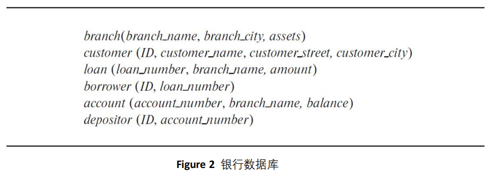
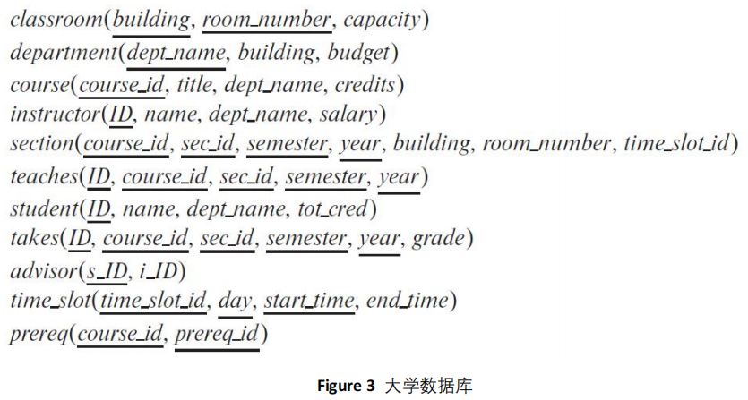

姓名：胡瑞康

学号：22336087

# 1. 考虑图 1 中的员工数据库。哪些是适当的主键？

employee (pid, person name, street, city): pid 是员工的唯一标识符，因此 pid 应该是主键。

works (person name, pid, company name, cid, salary): pid 和 cid 的组合可以唯一标识一个人在特定公司中的工作，因此 (pid, cid) 作为组合键是合适的主键。

company (cid, company name, city): cid 是公司表中每个公司的唯一标识符，因此 cid 是主键。

# 2. 考虑图 1 中的员工数据库。给出一个关系代数表达式来表示以下查询：

## a. 查找每位不在“BigBank”工作的员工的 ID 和姓名。

- 首先，找出在“BigBank”工作的所有员工的 `pid`。
- 然后，将这些员工的 `pid` 从所有员工的 `pid` 中排除，最后返回剩下员工的 `pid` 和姓名。

关系代数表达式：
$$
\pi_{pid, person\ name}(\sigma_{company\ name \neq "BigBank"}(\text{employee} \bowtie \text{works} \bowtie \text{company}))
$$

## b. 查找每位至少和数据库中的一位员工薪资一样多的员工的 ID 和姓名。

关系代数表达式：
$$
\pi_{pid, person\ name}(\sigma_{salary \geq w.salary}(\text{works} \times \text{works\ as\ w}))
$$

# 3. 考虑图 2 中的银行数据库。给出关系代数表达式来表示以下查询：

## a. 找到每个贷款金额大于 $10,000 的贷款号。

- 这个查询涉及 `loan` 表中的 `amount` 字段，要求找到所有金额大于 10,000 的贷款号。

关系代数表达式：

$$
\pi_{loan\_number}(\sigma_{amount > 10000}(\text{loan}))
$$

## b. 找到每位有账户余额大于 $6,000 的存款人的 ID。

- 这个查询需要结合 `account` 和 `depositor` 表，因为存款人的 ID 存在于 `depositor` 表中，而余额信息在 `account` 表中。

关系代数表达式：

$$
\pi_{ID}(\sigma_{balance > 6000}(\text{account} \bowtie \text{depositor}))
$$

## c. 找到每位在 “Uptown” 分行有账户余额大于 $6,000 的存款人的 ID。

- 这个查询还涉及 `branch` 表，因为需要过滤出特定分行的账户。先从 `branch` 表中找出分行为 "Uptown" 的账户，再结合其他表进行查询。

关系代数表达式：

$$
\pi_{ID}(\sigma_{balance > 6000 \land branch\_name = "Uptown"}((\text{account} \bowtie \text{branch}) \bowtie \text{depositor}))
$$

# 5.使用大学数据库模式(Figure 3)，用关系代数编写以下查询：

## a. 找到物理系的每位教师的 ID 和姓名。
- 这需要从 `instructor` 表中找到 `dept_name` 为“Physics”的教师。

关系代数表达式：
$$
\pi_{ID, name}(\sigma_{dept\_name = "Physics"}(\text{instructor}))
$$

## b. 找到位于“Watson”教学楼的每位系的教师的 ID 和姓名。
- 需要结合 `instructor` 表和 `department` 表，查询 `department` 表中 `building` 为“Watson”的教师。

关系代数表达式：
$$
\pi_{ID, name}(\sigma_{building = "Watson"}(\text{instructor} \bowtie \text{department}))
$$

## c. 找到至少选修过一门“Comp. Sci.”系的每位学生的 ID 和姓名。
- 需要从 `course` 表中找到 `dept_name` 为“Comp. Sci.”的课程，然后结合 `takes` 和 `student` 表找到相关学生。

关系代数表达式：
$$
\pi_{ID, name}(\text{student} \bowtie \sigma_{dept\_name = "Comp. Sci."}(\text{takes} \bowtie \text{course}))
$$

## d. 找到在 2018 年至少选修过一门课程的每位学生的 ID 和姓名。
- 直接从 `takes` 表中找到 `year = 2018` 的记录，然后结合 `student` 表查询相关学生。

关系代数表达式：
$$
\pi_{ID, name}(\sigma_{year = 2018}(\text{student} \bowtie \text{takes}))
$$

## e. 找到在 2018 年没有选修过任何课程的每位学生的 ID 和姓名。
- 这个查询需要从 `student` 表中找到没有出现在 `takes` 表中 `year = 2018` 记录的学生。

关系代数表达式：
$$
\pi_{ID, name}(\text{student}) - \pi_{ID, name}(\sigma_{year = 2018}(\text{student} \bowtie \text{takes}))
$$