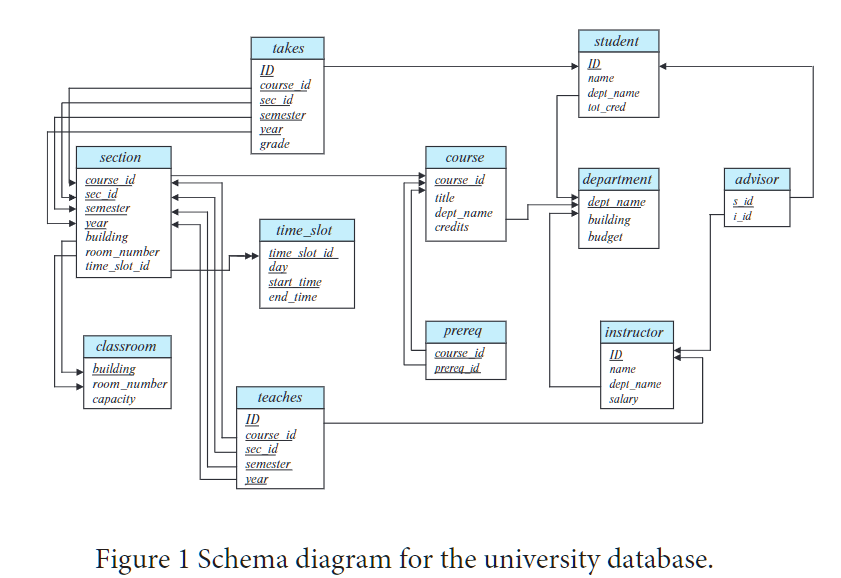

# ch4

1. **外连接表达式**可以在SQL中不使用SQL outer join操作来计算。为了说明这一点，展示如何重写以下SQL查询而不使用外连接表达式：
    ```sql
    select * from student natural left outer join takes
    select * from student natural full outer join takes
    ```

2. SQL允许外键依赖引用相同的关系，如以下示例中所示：
    ```sql
    create table manager
    (employee ID char(20),
    manager ID char(20),
    primary key (employee ID),
    foreign key (manager ID) references manager(employee ID)
    on delete cascade );
    ```
    在这里，“employee ID”是“manager”表的主键，这意味着每个员工最多只有一个经理。外键子句要求每位经理也必须是一名员工。请解释当“manager”关系中的元组被删除时会发生什么事情。

3. 定义一个名为"tot_credits"的视图（year, num_credits），该视图显示每年所修的总学分数。

4. 请表达以下查询的SQL，不使用子查询和集合操作（参考fig 1）：
    ```sql
    select ID
    from student
    except
    select s_id
    from advisor
    where i_ID is not null;
    ```

5. 重新编写查询，使用内连接和使用"using"条件来代替"natural join" （参考fig1）：
    ```sql
    select *
    from section natural join classroom;
    ```

6. 假设用户A对关系r具有所有授权权限，并将关系r的select权限授予public，并附带授权选项。假设用户B随后将r的select权限授予A。这样会在授权图中产生一个循环吗？请解释原因。

