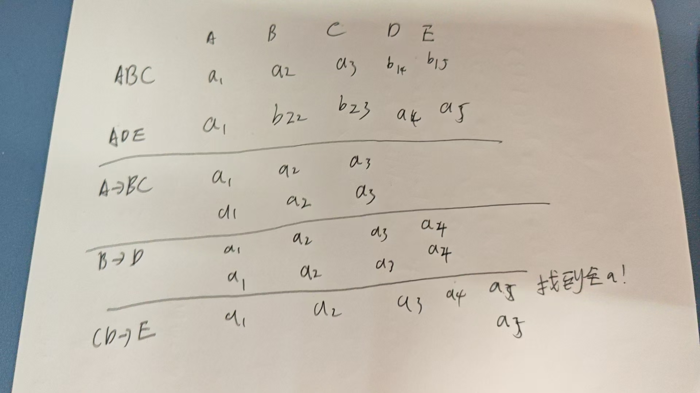

姓名：胡瑞康

学号：22336087

# 1.

## 题目

假设将模式

$ R = (A, B, C, D, E) $

分解为

$ (A, B, C) $

和

$ (A, D, E) $。

请证明，如果以下函数依赖关系集 $ F $ 成立，这种分解是无损分解的：

1. $ A \rightarrow BC $
2. $ CD \rightarrow E $
3. $ B \rightarrow D $
4. $ E \rightarrow A $

### 答案

无损分解的条件是：至少有一个子模式的主键能够通过原模式中的函数依赖关系得到原模式的所有属性。

1. 对于子模式 $ (A, B, C) $，它包含属性 $ A $，根据依赖关系 $ A \rightarrow BC $，可以得到 $ B $ 和 $ C $，因此可以通过 $ (A, B, C) $ 重构 $ (A, B, C, D, E) $ 中的部分属性。

2. 对于子模式 $ (A, D, E) $，同样包含属性 $ A $，再加上依赖关系 $ E \rightarrow A $，可以得到 $ A $，然后通过 $ CD \rightarrow E $ 也可以得到 $ E $。

3. 因此，从两个子模式中能够重构出原模式 $ R $，所以这个分解是无损的。

---
更新版

# 2.

## 题目

给出问题1中模式 $ R $ 的 BCNF 的无损分解。

$ R = (A, B, C, D, E) $

分解为$ (A, B, C) $和$ (A, D, E) $。

$ F $为：

1. $ A \rightarrow BC $
2. $ CD \rightarrow E $
3. $ B \rightarrow D $
4. $ E \rightarrow A $

### 答案

从这些依赖中，可以得出 $ A $ , $ E $ 和 $ CD $ 是**候选键**，因为 $ A $ 可以推出 $ B, C, D $，而 $ E $ 可以推出 $ A $ 及其依赖的属性。

接下来，我们检查每个函数依赖的左部是否为超键：

- $ A \rightarrow BC $：$ A $ 是超键，满足 BCNF。
- $ CD \rightarrow E $：$ CD $ 可以推出 $ E $，再通过 $ E $ 推出 $ A $，因此 $ CD $ 是超键，满足 BCNF。
- $ B \rightarrow D $：$ B $ 不是超键，不满足 BCNF。
- $ E \rightarrow A $：$ E $ 是超键，满足 BCNF。

由于 $ B \rightarrow D $ 不满足 BCNF，我们对其进行分解：

- $ R_1 = (B, D) $，因为 $ B $ 可以推出 $ D $。
- $ R_2 = R - \{D\} = (A, B, C, E) $。

现在，我们检查 $ R_1 $ 和 $ R_2 $ 是否在 BCNF 中：

- $ R_1 = (B, D) $，依赖 $ B \rightarrow D $，$ B $ 是超键，满足 BCNF。
- $ R_2 = (A, B, C, E) $，依赖 $ A \rightarrow B, A \rightarrow C, E \rightarrow A $，所有左部都是超键，满足 BCNF。

因此，最终的无损且符合 BCNF 的分解为：

$$
\rho = \{ (B, D), (A, B, C, E) \}
$$

# 3.

## 题目

对问题1的模式 $ R $ 进行 3NF 分解，同时保持无损和依赖。
$ R = (A, B, C, D, E) $

分解为$ (A, B, C) $和$ (A, D, E) $。

$ F $为：

1. $ A \rightarrow BC $
2. $ CD \rightarrow E $
3. $ B \rightarrow D $
4. $ E \rightarrow A $
### 答案

$F_{min} = \{A \rightarrow B,A \rightarrow C,CD \rightarrow E,B \rightarrow D, E \rightarrow A\}$

将最小依赖集中那些**左部相同**的 FD 用**合并性合并**起来。

$\{A \rightarrow BC,CD \rightarrow E,B \rightarrow D, E \rightarrow A\}$

对最小依赖集中的**每个** FD $ X \rightarrow Y $，**构成一个模式** $ XY $。

(ABC),(CDE),(BD),(AE)

$ A $ , $ E $ 和 $ CD $ 是**候选键**

包含候选键,无需再添加

# 4.

## 题目

证明问题1中的分解不是一个依赖保持分解。
$ R = (A, B, C, D, E) $

分解为$ R1=(A, B, C) $和$ R2=(A, D, E) $。

$ F $为：

1. $ A \rightarrow BC $
2. $ CD \rightarrow E $
3. $ B \rightarrow D $
4. $ E \rightarrow A $
### 答案

求属性闭包
(A)+=U,(CD)+=U,(B)+=(BD),(E)+=U,(C)+={C},(D)+={D}

$F_1=\{ A \rightarrow BC \}$
$F_2=\{ A \rightarrow D,A \rightarrow E,E \rightarrow A,E \rightarrow D \}$

$G = F_1 \cup F_2 =\{ A \rightarrow BC, A \rightarrow D,A \rightarrow E,E \rightarrow A,E \rightarrow D \}$

少了2,3

计算CD,B在G下的闭包

(CD)+={CD},E不在这个闭包,不保持函数依赖

