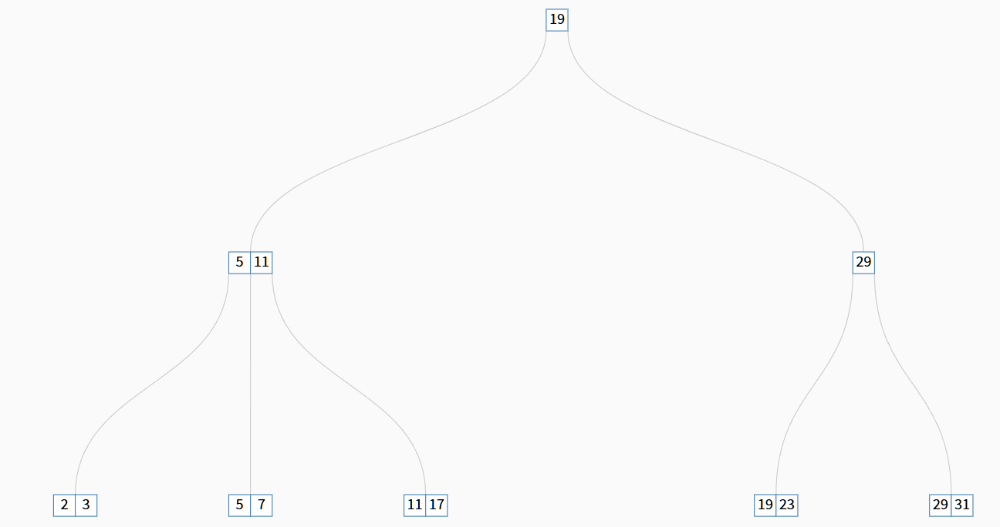
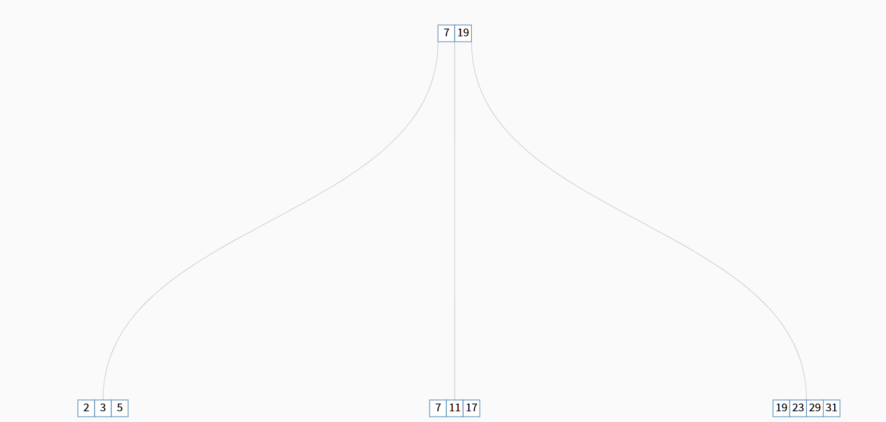
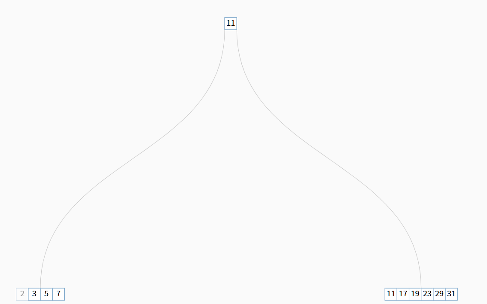

姓名：胡瑞康

学号：22336087


# 第1题：可变长度记录表示中的Null Bitmap

## 1.a. 对于变长字段，如果值为空，偏移（offset）和长度（length）字段将存储什么？

在可变长度记录表示中，Null Bitmap 用于指示各个属性是否为NULL。当某个变长字段的值为空时：

- 偏移（offset）字段：通常会存储一个特殊值，比如 `0` 或 `-1`，表示该字段没有有效的数据位置。
- 长度（length）字段：会存储 `0`，表示该字段的长度为零，即没有数据。

这种表示方式可以有效地标识出该字段为空，同时避免了不必要的数据存储。

## 1.b. 如果元组具有大量属性，其中大多数属性为空，是否可以修改记录表示，使得Null属性的唯一开销是Null Bitmap中的一个bit？

是的，可以通过以下方式优化记录表示：

- 使用Null Bitmap：为每个属性分配一个比特位，用于指示该属性是否为NULL。这样，即使有大量属性为空，只有对应的比特位被设置，节省了空间。

- 可变长度字段的优化：对于变长字段，如果其值为空，不存储实际的偏移和长度信息，只通过Null Bitmap标识为空。这避免了为每个NULL属性分配额外的偏移和长度字段的空间。

这种方法的优点在于：

- 空间效率高：对于大量为空的属性，只需使用一个比特位，而无需额外的空间来存储偏移和长度。
- 简化处理：在数据访问和更新时，可以快速检查Null Bitmap，确定哪些属性为空，减少不必要的操作。

# 2. 构建一棵 $B +$ 树,其中包含以下一组键值:

(2,3,5,7,11,17,19,23,29,31)

假设该树最初为空,并且值按升序添加。构建 B+树,其中树的节点可以容纳的指针数量分别如下:

代码实现
```python
import math

class BPlusTreeNode:
    def __init__(self, order, leaf=False):
        self.order = order  # 阶数
        self.leaf = leaf    # 是否为叶子节点
        self.keys = []      # 键列表
        self.children = []  # 子节点列表（对于内部节点）
        self.next = None    # 叶子节点的下一个节点（仅叶子节点使用）

    def is_full(self):
        return len(self.keys) > self.order - 1  # 修改为 >

class BPlusTree:
    def __init__(self, order):
        self.order = order
        self.root = BPlusTreeNode(order, leaf=True)

    def find_parent(self, current, child):
        if current.leaf:
            return None  # 叶子节点没有子节点
        for c in current.children:
            if c is child:
                return current
            if not c.leaf:
                parent = self.find_parent(c, child)
                if parent:
                    return parent
        return None

    def find_leaf(self, key, verbose=False):
        current = self.root
        while not current.leaf:
            if verbose:
                print(f"Traversing node with keys: {current.keys}")
            i = 0
            while i < len(current.keys) and key >= current.keys[i]:
                i += 1
            current = current.children[i]
        if verbose:
            print(f"Leaf node found with keys: {current.keys}")
        return current

    def insert(self, key):
        root = self.root
        if root.is_full():
            new_root = BPlusTreeNode(self.order)
            new_root.children.append(self.root)
            self.split_child(new_root, 0)
            self.root = new_root
            print(f"Root was split. New root keys: {self.root.keys}")
        self._insert_non_full(self.root, key)

    def _insert_non_full(self, node, key):
        if node.leaf:
            self.insert_in_leaf(node, key)
        else:
            i = 0
            while i < len(node.keys) and key >= node.keys[i]:
                i += 1
            child = node.children[i]
            if child.is_full():
                self.split_child(node, i)
                if key > node.keys[i]:
                    i += 1
            self._insert_non_full(node.children[i], key)

    def insert_in_leaf(self, leaf, key):
        leaf.keys.append(key)
        leaf.keys.sort()
        print(f"Inserted {key} into leaf: {leaf.keys}")
        if leaf.is_full():
            parent = self.find_parent(self.root, leaf)
            if parent is None:
                # 如果叶子节点是根节点，需要创建新的根
                new_root = BPlusTreeNode(self.order)
                new_root.children.append(self.root)
                self.split_child(new_root, 0)
                self.root = new_root
                print(f"Root was split. New root keys: {self.root.keys}")
            else:
                index = parent.children.index(leaf)
                self.split_child(parent, index)
                # 递归检查父节点是否需要分裂
                self.handle_parent_overflow(parent)

    def handle_parent_overflow(self, node):
        if node.is_full():
            parent = self.find_parent(self.root, node)
            if parent is None:
                # 节点是根节点，创建新的根
                new_root = BPlusTreeNode(self.order)
                new_root.children.append(self.root)
                self.split_child(new_root, 0)
                self.root = new_root
                print(f"Root was split. New root keys: {self.root.keys}")
            else:
                index = parent.children.index(node)
                self.split_child(parent, index)
                self.handle_parent_overflow(parent)

    def split_child(self, parent, index):
        node = parent.children[index]

        if node.leaf:
            # 分裂叶子节点
            mid = len(node.keys) // 2
            new_node = BPlusTreeNode(self.order, leaf=True)
            new_node.keys = node.keys[mid:]
            node.keys = node.keys[:mid]
            new_node.next = node.next
            node.next = new_node

            parent.keys.insert(index, new_node.keys[0])
            parent.children.insert(index + 1, new_node)
            print(f"Split leaf node. Parent keys now: {parent.keys}")
        else:
            # 分裂内部节点
            mid = len(node.keys) // 2
            split_key = node.keys[mid]

            new_node = BPlusTreeNode(self.order, leaf=False)
            new_node.keys = node.keys[mid + 1:]
            new_node.children = node.children[mid + 1:]
            node.keys = node.keys[:mid]
            node.children = node.children[:mid + 1]

            parent.keys.insert(index, split_key)
            parent.children.insert(index + 1, new_node)
            print(f"Split internal node. Parent keys now: {parent.keys}")

    def print_tree(self):
        def _print_node(node, level, parent_keys):
            indent = "    " * level
            if parent_keys is None:
                print(f"{indent}Level {level}: {node.keys}")
            else:
                print(f"{indent}Level {level}: {node.keys} (linked from {parent_keys})")
            if not node.leaf:
                for child in node.children:
                    _print_node(child, level + 1, node.keys)

        _print_node(self.root, 0, None)

    def search(self, key):
        leaf = self.find_leaf(key)
        for item in leaf.keys:
            if item == key:
                return True
        return False

    def range_search(self, start, end):
        results = []
        leaf = self.find_leaf(start)
        while leaf:
            for key in leaf.keys:
                if start <= key <= end:
                    results.append(key)
                elif key > end:
                    return results
            leaf = leaf.next
        return results

if __name__ == "__main__":
    keys = [2, 3, 5, 7, 11, 17, 19, 23, 29, 31]

    orders = [4,6,8]

    for order in orders:
        print(f"\n构建B+树，阶数 = {order}:")
        tree = BPlusTree(order=order)
        for key in keys:
            tree.insert(key)
            print(f"插入 {key}:")
            tree.print_tree()
            print("-" * 40)
        print("最终B+树结构:")
        tree.print_tree()
        print("=" * 60)
```

## 2.a. 四个
```
Level 0: [19]
    Level 1: [5, 11] (linked from [19])
        Level 2: [2, 3] (linked from [5, 11])
        Level 2: [5, 7] (linked from [5, 11])
        Level 2: [11, 17] (linked from [5, 11])
    Level 1: [29] (linked from [19])
        Level 2: [19, 23] (linked from [29])
        Level 2: [29, 31] (linked from [29])
```
结合可视化网页验证

## 2.b. 六个
```
Level 0: [7, 19]
    Level 1: [2, 3, 5] (linked from [7, 19])
    Level 1: [7, 11, 17] (linked from [7, 19])
    Level 1: [19, 23, 29, 31] (linked from [7, 19])
```
结合可视化网页验证

## 2.c. 八个
```
Level 0: [11]
    Level 1: [2, 3, 5, 7] (linked from [11])
    Level 1: [11, 17, 19, 23, 29, 31] (linked from [11])
```

结合可视化网页验证

# 第3题：查询步骤说明

## 3.a. 查找搜索键值为11的记录

### 2.a. 每个节点可容纳4个指针的B⁺树

在阶数为4的B⁺树中，树结构如下：

```
Level 0: [19]
    Level 1: [5, 11] (linked from [19])
        Level 2: [2, 3] (linked from [5, 11])
        Level 2: [5, 7] (linked from [5, 11])
        Level 2: [11, 17] (linked from [5, 11])
    Level 1: [29] (linked from [19])
        Level 2: [19, 23] (linked from [29])
        Level 2: [29, 31] (linked from [29])
```

查找步骤：

1. 访问根节点 `[19]`。
2. 比较键值 `11` 与根节点的键 `19`：
   - 由于 `11 < 19`，选择第一个子节点 `[5, 11]`。
3. 访问子节点 `[5, 11]`。
4. 比较键值 `11` 与子节点的键：
   - 遍历键 `5` 和 `11`，发现 `11` 匹配。
5. 在叶子节点 `[11, 17]` 中找到键值 `11`。

结论： 键值 `11` 在叶子节点 `[11, 17]` 中被成功找到。

### 2.b. 每个节点可容纳6个指针的B⁺树

在阶数为6的B⁺树中，树结构如下：

```
Level 0: [7, 19]
    Level 1: [2, 3, 5] (linked from [7, 19])
    Level 1: [7, 11, 17] (linked from [7, 19])
    Level 1: [19, 23, 29, 31] (linked from [7, 19])
```

查找步骤：

1. 访问根节点 `[7, 19]`。
2. 比较键值 `11` 与根节点的键：
   - `11 > 7` 且 `11 < 19`，选择第二个子节点 `[7, 11, 17]`。
3. 访问子节点 `[7, 11, 17]`。
4. 比较键值 `11` 与子节点的键：
   - 遍历键 `7`, `11`, `17`，发现 `11` 匹配。
5. 在叶子节点 `[7, 11, 17]` 中找到键值 `11`。

结论： 键值 `11` 在叶子节点 `[7, 11, 17]` 中被成功找到。

### 2.c. 每个节点可容纳8个指针的B⁺树

在阶数为8的B⁺树中，树结构如下：

```
Level 0: [11]
    Level 1: [2, 3, 5, 7] (linked from [11])
    Level 1: [11, 17, 19, 23, 29, 31] (linked from [11])
```

查找步骤：

1. 访问根节点 `[11]`。
2. 比较键值 `11` 与根节点的键：
   - `11 == 11`，选择第二个子节点 `[11, 17, 19, 23, 29, 31]`。
3. 访问子节点 `[11, 17, 19, 23, 29, 31]`。
4. 比较键值 `11` 与子节点的键：
   - 遍历键 `11`, `17`, `19`, `23`, `29`, `31`，发现 `11` 匹配。
5. 在叶子节点 `[11, 17, 19, 23, 29, 31]` 中找到键值 `11`。

结论： 键值 `11` 在叶子节点 `[11, 17, 19, 23, 29, 31]` 中被成功找到。

## 3.b. 查找搜索键值在7到17之间（包括7和17）的记录

### 2.a. 每个节点可容纳4个指针的B⁺树

在阶数为4的B⁺树中，树结构如下：

```
Level 0: [19]
    Level 1: [5, 11] (linked from [19])
        Level 2: [2, 3] (linked from [5, 11])
        Level 2: [5, 7] (linked from [5, 11])
        Level 2: [11, 17] (linked from [5, 11])
    Level 1: [29] (linked from [19])
        Level 2: [19, 23] (linked from [29])
        Level 2: [29, 31] (linked from [29])
```

查找步骤：

1. 访问根节点 `[19]`。
2. 确定范围 `7 ≤ key ≤ 17`：
   - 选择第一个子节点 `[5, 11]`，因为 `7` 和 `17` 都小于 `19`。
3. 访问子节点 `[5, 11]`。
4. 在子节点中确定叶子节点：
   - 访问第一个叶子节点 `[2, 3]`，无匹配。
   - 访问第二个叶子节点 `[5, 7]`，找到 `7`。
   - 访问第三个叶子节点 `[11, 17]`，找到 `11` 和 `17`。
5. 收集匹配的键值 `7`, `11`, `17`。

结论： 键值 `7`, `11`, `17` 在范围查询中被成功找到。

### 2.b. 每个节点可容纳6个指针的B⁺树

在阶数为6的B⁺树中，树结构如下：

```
Level 0: [7, 19]
    Level 1: [2, 3, 5] (linked from [7, 19])
    Level 1: [7, 11, 17] (linked from [7, 19])
    Level 1: [19, 23, 29, 31] (linked from [7, 19])
```

查找步骤：

1. 访问根节点 `[7, 19]`。
2. 确定范围 `7 ≤ key ≤ 17`：
   - `7` 属于第一个子节点 `[2, 3, 5]` 和第二个子节点 `[7, 11, 17]`。
3. 访问第一个子节点 `[2, 3, 5]`：
   - 无匹配键值在范围内。
4. 访问第二个子节点 `[7, 11, 17]`：
   - 找到 `7`, `11`, `17`。
5. 收集匹配的键值 `7`, `11`, `17`。

结论： 键值 `7`, `11`, `17` 在范围查询中被成功找到。

### 2.c. 每个节点可容纳8个指针的B⁺树

在阶数为8的B⁺树中，树结构如下：

```
Level 0: [11]
    Level 1: [2, 3, 5, 7] (linked from [11])
    Level 1: [11, 17, 19, 23, 29, 31] (linked from [11])
```

查找步骤：

1. 访问根节点 `[11]`。
2. 确定范围 `7 ≤ key ≤ 17`：
   - 选择第一个子节点 `[2, 3, 5, 7]` 和第二个子节点 `[11, 17, 19, 23, 29, 31]`。
3. 访问第一个子节点 `[2, 3, 5, 7]`：
   - 找到 `7`。
4. 访问第二个子节点 `[11, 17, 19, 23, 29, 31]`：
   - 找到 `11` 和 `17`。
5. 收集匹配的键值 `7`, `11`, `17`。

结论： 键值 `7`, `11`, `17` 在范围查询中被成功找到。

# 第4题：按排序顺序插入索引条目时B⁺树叶子节点的占用情况

当按照键值的升序顺序插入索引条目时，B⁺树的叶子节点会呈现特定的占用模式。具体表现如下：

1. 叶子节点的填充方式：
   - 由于插入是按排序顺序进行，新的键值总是插入到当前最右边的叶子节点。
   - 这导致叶子节点从左到右依次被填满，直到达到其容量限制。

2. 节点分裂的模式：
   - 当一个叶子节点达到其最大容量时，会进行分裂，将中间的键值提升到父节点。
   - 由于插入顺序是有序的，分裂通常发生在叶子节点的最右边。

3. 占用情况的特点：
   - 初始阶段：叶子节点会逐渐被填满，直到需要分裂。
   - 后期阶段：叶子节点几乎总是被完全填满，接近或达到其最大容量。
   - 整体效果：叶子节点的占用率较高，空间利用率良好，减少了空间的浪费。

4. 原因分析：
   - 顺序插入导致数据集中在特定的叶子节点，减少了节点间的数据分布均衡性。
   - 分裂操作频繁发生在叶子节点的末端，确保每个叶子节点都被充分利用。

综上所述，按排序顺序插入索引条目会使B⁺树的叶子节点逐步被填满，保持较高的空间利用率，同时在达到节点容量限制时进行适当的分裂操作，以维持树的平衡性和查询效率。